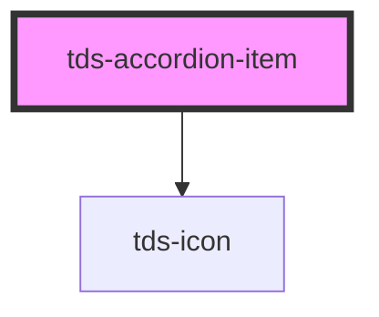

# tds-accordion-item

<!-- Auto Generated Below -->

## Properties

| Property             | Attribute              | Description                                                                                    | Type               | Default |
| -------------------- | ---------------------- | ---------------------------------------------------------------------------------------------- | ------------------ | ------- |
| `disabled`           | `disabled`             | Disabled option in `boolean`.                                                                  | `boolean`          | `false` |
| `expandIconPosition` | `expand-icon-position` | Changes position of the expand icon.                                                           | `"end" \| "start"` | `'end'` |
| `expanded`           | `expanded`             | Set to true to expand panel open                                                               | `boolean`          | `false` |
| `header`             | `header`               | The header gives users the context about the additional information available inside the panel | `string`           | `''`    |
| `paddingReset`       | `padding-reset`        | When true, 16px on right padding instead of 64px                                               | `boolean`          | `false` |

## Events

| Event       | Description                                                                  | Type                                  |
| ----------- | ---------------------------------------------------------------------------- | ------------------------------------- |
| `tdsToggle` | Fires when the Accordion Item is clicked, but before it is closed or opened. | `CustomEvent<{ expanded: boolean; }>` |

## Methods

### `toggleAccordionItem() => Promise<void>`

Method for toggling the expanded state of the Accordion Item.

#### Returns

Type: `Promise<void>`

## Slots

| Slot       | Description                         |
| ---------- | ----------------------------------- |
| `"header"` | Slot for the Accordion Item header. |

## Dependencies

### Depends on

- [tds-icon](../../icon)

### Graph

----------------------------------------------

*Built with [StencilJS](https://stenciljs.com/)*
