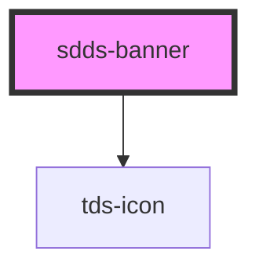

# sdds-banner

<!-- Auto Generated Below -->

## Properties

| Property     | Attribute    | Description                                                                                                                                                                                                                                        | Type                                 | Default               |
| ------------ | ------------ | -------------------------------------------------------------------------------------------------------------------------------------------------------------------------------------------------------------------------------------------------- | ------------------------------------ | --------------------- |
| `bannerId`   | `banner-id`  | ID used for internal table functionality and events, must be unique.  **NOTE**: If you're listening for Banner close events you need to set this ID yourself to identify the Banner, as the default ID is random and will be different every time. | `string`                             | `crypto.randomUUID()` |
| `header`     | `header`     | Header text.                                                                                                                                                                                                                                       | `string`                             | `undefined`           |
| `hidden`     | `hidden`     | Hides the Banner                                                                                                                                                                                                                                   | `boolean`                            | `false`               |
| `icon`       | `icon`       | Name of the icon for the component. For error and information type the icon is predefined.                                                                                                                                                         | `string`                             | `undefined`           |
| `persistent` | `persistent` | Removes the close button on the Banner.                                                                                                                                                                                                            | `boolean`                            | `false`               |
| `type`       | `type`       | Type of Banner                                                                                                                                                                                                                                     | `"error" \| "information" \| "none"` | `'none'`              |

## Events

| Event       | Description                                                          | Type                                 |
| ----------- | -------------------------------------------------------------------- | ------------------------------------ |
| `sddsClose` | Sends a unique Banner identifier when the close button is pressed.   | `CustomEvent<{ bannerId: string; }>` |
| `sddsShow`  | Sends the unique Banner identifier when the close button is pressed. | `CustomEvent<{ bannerId: string; }>` |

## Methods

### `hideBanner() => Promise<void>`

Hides the Banner.

#### Returns

Type: `Promise<void>`

### `showBanner() => Promise<void>`

Shows the Banner

#### Returns

Type: `Promise<void>`

## Dependencies

### Depends on

- [tds-icon](../icon)

### Graph

----------------------------------------------

*Built with [StencilJS](https://stenciljs.com/)*
