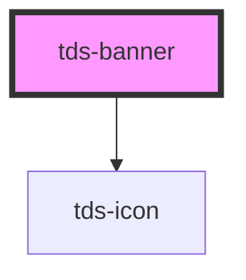

# tds-banner

<!-- Auto Generated Below -->

## Properties

| Property     | Attribute    | Description                                                                                                                                                                                                                                         | Type                                 | Default              |
| ------------ | ------------ | --------------------------------------------------------------------------------------------------------------------------------------------------------------------------------------------------------------------------------------------------- | ------------------------------------ | -------------------- |
| `bannerId`   | `banner-id`  | ID used for internal table functionality and events, must be unique.  **NOTE**: If you're listening for Banner close events, you need to set this ID yourself to identify the Banner, as the default ID is random and will be different every time. | `string`                             | `generateUniqueId()` |
| `header`     | `header`     | Header text.                                                                                                                                                                                                                                        | `string`                             | `undefined`          |
| `hidden`     | `hidden`     | Hides the Banner                                                                                                                                                                                                                                    | `boolean`                            | `false`              |
| `icon`       | `icon`       | Name of the icon for the component. For error and information variant, the icon is predefined.                                                                                                                                                      | `string`                             | `undefined`          |
| `persistent` | `persistent` | Removes the close button on the Banner.                                                                                                                                                                                                             | `boolean`                            | `false`              |
| `subheader`  | `subheader`  | Subheader text.                                                                                                                                                                                                                                     | `string`                             | `undefined`          |
| `variant`    | `variant`    | Variant of Banner                                                                                                                                                                                                                                   | `"error" \| "information" \| "none"` | `'none'`             |

## Events

| Event      | Description                                                          | Type                                 |
| ---------- | -------------------------------------------------------------------- | ------------------------------------ |
| `tdsClose` | Sends a unique Banner identifier when the close button is pressed.   | `CustomEvent<{ bannerId: string; }>` |
| `tdsShow`  | Sends the unique Banner identifier when the close button is pressed. | `CustomEvent<{ bannerId: string; }>` |

## Methods

### `hideBanner() => Promise<void>`

Hides the Banner.

#### Returns

Type: `Promise<void>`

### `showBanner() => Promise<void>`

Shows the Banner

#### Returns

Type: `Promise<void>`

## Slots

| Slot          | Description                                             |
| ------------- | ------------------------------------------------------- |
| `"bottom"`    | Slot for the bottom part of the Banner, used for links. |
| `"header"`    | Slot for the Header of the Banner                       |
| `"subheader"` | Slot for the Subheader of the Banner                    |

## Dependencies

### Depends on

- [tds-icon](../icon)

### Graph

----------------------------------------------

*Built with [StencilJS](https://stenciljs.com/)*
