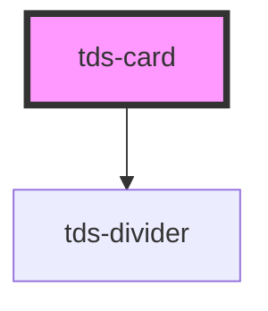

# tds-card

<!-- Auto Generated Below -->

## Properties

| Property          | Attribute          | Description                                                                                                                                                                                           | Type                       | Default               |
| ----------------- | ------------------ | ----------------------------------------------------------------------------------------------------------------------------------------------------------------------------------------------------- | -------------------------- | --------------------- |
| `bodyDivider`     | `body-divider`     | Divider for the body                                                                                                                                                                                  | `boolean`                  | `false`               |
| `bodyImg`         | `body-img`         | Body image src                                                                                                                                                                                        | `string`                   | `undefined`           |
| `bodyImgAlt`      | `body-img-alt`     | Alt text for the body image                                                                                                                                                                           | `string`                   | `undefined`           |
| `cardId`          | `card-id`          | ID for the Card, must be unique.  **NOTE**: If you're listening for Card events, you need to set this ID yourself to identify the Card, as the default ID is random and will be different every time. | `string`                   | `crypto.randomUUID()` |
| `clickable`       | `clickable`        | Makes the Card clickable.                                                                                                                                                                             | `boolean`                  | `false`               |
| `header`          | `header`           | Header text for the Card.                                                                                                                                                                             | `string`                   | `undefined`           |
| `headerPlacement` | `header-placement` | Placement of the header                                                                                                                                                                               | `"above" \| "below"`       | `'above'`             |
| `modeVariant`     | `mode-variant`     | Variant of the Card based on the theme used.                                                                                                                                                          | `"primary" \| "secondary"` | `null`                |
| `subheader`       | `subheader`        | Subheader text for the Card.                                                                                                                                                                          | `string`                   | `undefined`           |

## Events

| Event      | Description                                                              | Type                               |
| ---------- | ------------------------------------------------------------------------ | ---------------------------------- |
| `tdsClick` | Sends unique Card identifier when the Card is clicked, if clickable=true | `CustomEvent<{ cardId: string; }>` |

## Slots

| Slot               | Description                              |
| ------------------ | ---------------------------------------- |
| `"card-body"`      | Slot for the body section of the Card.   |
| `"card-bottom"`    | Slot for the bottom section of the Card. |
| `"card-subheader"` | Slot for the Card subheader.             |
| `"card-thumbnail"` | Slot for the Card thumbnail.             |

## Dependencies

### Depends on

- [tds-divider](../divider)

### Graph

----------------------------------------------

*Built with [StencilJS](https://stenciljs.com/)*
