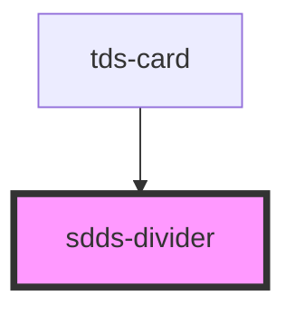

# sdds-divider

<!-- Auto Generated Below -->

## Properties

| Property      | Attribute     | Description                                              | Type                         | Default        |
| ------------- | ------------- | -------------------------------------------------------- | ---------------------------- | -------------- |
| `orientation` | `orientation` | Orientation of the Divider, horizontal if not specified. | `"horizontal" \| "vertical"` | `'horizontal'` |

## Dependencies

### Used by

 - [tds-card](../card)

### Graph

----------------------------------------------

*Built with [StencilJS](https://stenciljs.com/)*
