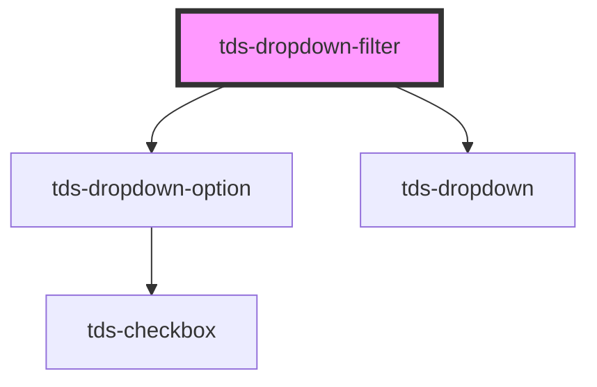

# Dropdown filter

<!-- Auto Generated Below -->

## Properties

| Property         | Attribute         | Description                                                                                                                              | Type                                                     | Default      |
| ---------------- | ----------------- | ---------------------------------------------------------------------------------------------------------------------------------------- | -------------------------------------------------------- | ------------ |
| `data`           | `data`            | Data is an array of objects that contains label and value `data = [{label:'Option 1', value:'opt-1'},{label:'Option 2', value:'opt-2'}]` | `string`                                                 | `undefined`  |
| `defaultOption`  | `default-option`  | Add the value of the option to set it as default                                                                                         | `string`                                                 | `undefined`  |
| `disabled`       | `disabled`        | Add the value of the option to set it as default                                                                                         | `boolean`                                                | `false`      |
| `helper`         | `helper`          | Add helper text in the bottom of Dropdown                                                                                                | `string`                                                 | `''`         |
| `inline`         | `inline`          | Set to true to make the width following the label text length                                                                            | `boolean`                                                | `false`      |
| `label`          | `label`           | Label for Dropdown with no selected item                                                                                                 | `string`                                                 | `undefined`  |
| `labelPosition`  | `label-position`  | Position of label                                                                                                                        | `"no-label" \| "outside"`                                | `'no-label'` |
| `modeVariant`    | `mode-variant`    | Set the variant of the Dropdown.                                                                                                         | `"primary" \| "secondary"`                               | `null`       |
| `openDirection`  | `open-direction`  | Direction that the Dropdown will open. Default is auto.                                                                                  | `"auto" \| "down" \| "up"`                               | `'auto'`     |
| `placeholder`    | `placeholder`     | Placeholder text for Dropdown with no selected item                                                                                      | `string`                                                 | `''`         |
| `selectedOption` | `selected-option` | Add the value of the option as string to set it as new selected value                                                                    | `string`                                                 | `undefined`  |
| `size`           | `size`            | Controls the size of the Dropdown. 'sm', 'md' and 'lg' correct values and 'small', 'medium' and 'large' are deprecated                   | `"large" \| "lg" \| "md" \| "medium" \| "sm" \| "small"` | `'lg'`       |
| `state`          | `state`           | Support `error` state                                                                                                                    | `boolean`                                                | `false`      |

## Methods

### `resetOption() => Promise<void>`

Use this method to reset the Dropdown. Then it will go back to its initial state.

#### Returns

Type: `Promise<void>`

## Dependencies

### Depends on

- [tds-dropdown-option](../dropdown-option)
- [tds-dropdown](..)

### Graph

----------------------------------------------

*Built with [StencilJS](https://stenciljs.com/)*
