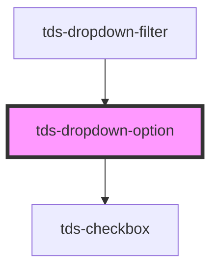

# Dropdown option

<!-- Auto Generated Below -->

## Properties

| Property   | Attribute  | Description                                                      | Type      | Default     |
| ---------- | ---------- | ---------------------------------------------------------------- | --------- | ----------- |
| `disabled` | `disabled` | Sets option to disabled state if true                            | `boolean` | `false`     |
| `selected` | `selected` | Selected a set to true if selected                               | `boolean` | `false`     |
| `value`    | `value`    | Value is a unique string that will be used for application logic | `string`  | `undefined` |

## Dependencies

### Used by

 - [tds-dropdown-filter](../dropdown-filter)

### Depends on

- [tds-checkbox](../../checkbox)

### Graph

----------------------------------------------

*Built with [StencilJS](https://stenciljs.com/)*
