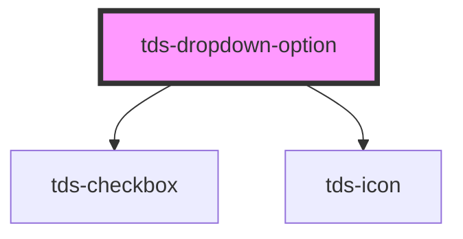

# tds-dropdown-option

<!-- Auto Generated Below -->

## Properties

| Property   | Attribute  | Description                    | Type      | Default     |
| ---------- | ---------- | ------------------------------ | --------- | ----------- |
| `disabled` | `disabled` | Sets the option as disabled.   | `boolean` | `false`     |
| `value`    | `value`    | Value for the Dropdown option. | `string`  | `undefined` |

## Events

| Event       | Description                          | Type                                                 |
| ----------- | ------------------------------------ | ---------------------------------------------------- |
| `tdsBlur`   | Blur event for the Dropdown option.  | `CustomEvent<FocusEvent>`                            |
| `tdsFocus`  | Focus event for the Dropdown option. | `CustomEvent<FocusEvent>`                            |
| `tdsSelect` | Click event for the Dropdown option. | `CustomEvent<{ selected: boolean; value: string; }>` |

## Methods

### `setSelected(selected: boolean) => Promise<void>`

Method to select/deselect an option if the option is not disabled.

#### Returns

Type: `Promise<void>`

## Dependencies

### Depends on

- [tds-checkbox](../../checkbox)
- [tds-icon](../../icon)

### Graph

----------------------------------------------

*Built with [StencilJS](https://stenciljs.com/)*
