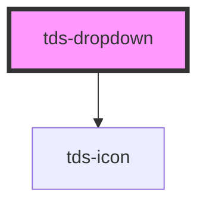

# tds-dropdown

### Good to know
 - Setting type='time' together with min and max props will not prevent user from set time outside min-max range. It is known issue for native input element. Here is more about it and how to work with it: [Time validation](https://developer.mozilla.org/en-US/docs/Web/HTML/Element/input/time#validation)

<!-- Auto Generated Below -->

## Properties

| Property        | Attribute        | Description                                                                                | Type                                                     | Default       |
| --------------- | ---------------- | ------------------------------------------------------------------------------------------ | -------------------------------------------------------- | ------------- |
| `defaultValue`  | `default-value`  | Value selected in the Dropdown.                                                            | `string`                                                 | `undefined`   |
| `disabled`      | `disabled`       | Sets the Dropdown in a disabled state                                                      | `boolean`                                                | `false`       |
| `error`         | `error`          | Sets the Dropdown in an error state                                                        | `boolean`                                                | `false`       |
| `filter`        | `filter`         | Enables filtration in the Dropdown.                                                        | `boolean`                                                | `false`       |
| `helper`        | `helper`         | Helper text for the Dropdown.                                                              | `string`                                                 | `undefined`   |
| `label`         | `label`          | Label text for the Dropdown.                                                               | `string`                                                 | `undefined`   |
| `labelPosition` | `label-position` | Label text position                                                                        | `"inside" \| "outside"`                                  | `undefined`   |
| `modeVariant`   | `mode-variant`   | Mode variant of the component, based on current mode.                                      | `"primary" \| "secondary"`                               | `null`        |
| `multiselect`   | `multiselect`    | Enables multiselect in the Dropdown.                                                       | `boolean`                                                | `false`       |
| `name`          | `name`           | Name for the Dropdowns input element.                                                      | `string`                                                 | `undefined`   |
| `noResultText`  | `no-result-text` | Text that is displayed if filter is used and there are no options that matches the search. | `string`                                                 | `'No result'` |
| `openDirection` | `open-direction` | The direction the Dropdown should open, auto if not specified.                             | `"auto" \| "down" \| "up"`                               | `'auto'`      |
| `options`       | --               | Populate the Dropdown via a JSON array                                                     | `{ value: string; label: string; disabled: boolean; }[]` | `undefined`   |
| `placeholder`   | `placeholder`    | Placeholder text for the Dropdown.                                                         | `string`                                                 | `undefined`   |
| `size`          | `size`           | The size of the Dropdown.                                                                  | `"lg" \| "md" \| "sm"`                                   | `'lg'`        |

## Events

| Event       | Description                    | Type                                            |
| ----------- | ------------------------------ | ----------------------------------------------- |
| `tdsBlur`   | Blur event for the Dropdown.   | `CustomEvent<FocusEvent>`                       |
| `tdsChange` | Change event for the Dropdown. | `CustomEvent<{ name: string; value: string; }>` |
| `tdsFocus`  | Focus event for the Dropdown.  | `CustomEvent<FocusEvent>`                       |
| `tdsInput`  | Input event for the Dropdown.  | `CustomEvent<InputEvent>`                       |

## Methods

### `close() => Promise<void>`

Method for closing the Dropdown.

#### Returns

Type: `Promise<void>`

### `removeValue(oldValue: string) => Promise<{ value: string; label: string; }[]>`

Method for removing a selected value in the Dropdown.

#### Returns

Type: `Promise<{ value: string; label: string; }[]>`

### `reset() => Promise<void>`

Method that resets the Dropdown, marks all children as non-selected and resets the value to null.

#### Returns

Type: `Promise<void>`

### `setValue(newValue: string, newValueLabel: string) => Promise<{ value: string; label: string; }[]>`

Method for setting the value of the Dropdown.

#### Returns

Type: `Promise<{ value: string; label: string; }[]>`

## Slots

| Slot          | Description                                        |
| ------------- | -------------------------------------------------- |
| `"<default>"` | <b>Unnamed slot.</b> For dropdown option elements. |

## Dependencies

### Depends on

- [tds-icon](../icon)

### Graph

----------------------------------------------

*Built with [StencilJS](https://stenciljs.com/)*
