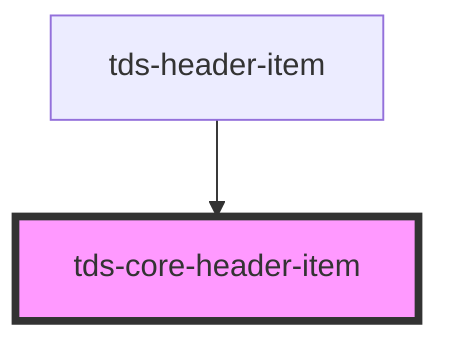

# tds-core-header-item

<!-- Auto Generated Below -->

## Dependencies

### Used by

 - [tds-header-item](../header-item)

### Depends on

- [sdds-checkbox](../../checkbox)

### Graph

----------------------------------------------

*Built with [StencilJS](https://stenciljs.com/)*
