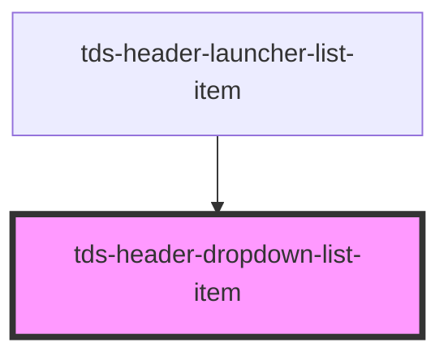

# tds-header-dropdown-list-item

<!-- Auto Generated Below -->

## Properties

| Property   | Attribute  | Description                         | Type           | Default |
| ---------- | ---------- | ----------------------------------- | -------------- | ------- |
| `selected` | `selected` | If the link should appear selected. | `boolean`      | `false` |
| `type`     | `type`     | The type of the list.               | `"lg" \| "md"` | `'md'`  |

## Slots

| Slot          | Description                                        |
| ------------- | -------------------------------------------------- |
| `"<default>"` | <b>Unnamed slot.</b> For a link or button element. |

## Dependencies

### Used by

 - [tds-header-launcher-list-item](../header-launcher-list-item)

### Graph

----------------------------------------------

*Built with [StencilJS](https://stenciljs.com/)*
