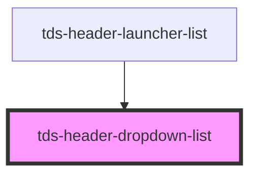

# tds-header-dropdown-list

<!-- Auto Generated Below -->

## Properties

| Property | Attribute | Description                | Type           | Default |
| -------- | --------- | -------------------------- | -------------- | ------- |
| `size`   | `size`    | The size of the component. | `"lg" \| "md"` | `'md'`  |

## Slots

| Slot          | Description                                    |
| ------------- | ---------------------------------------------- |
| `"<default>"` | <b>Unnamed slot.</b> For a dropdown list item. |

## Dependencies

### Used by

 - [tds-header-launcher-list](../header-launcher-list)

### Graph

----------------------------------------------

*Built with [StencilJS](https://stenciljs.com/)*
