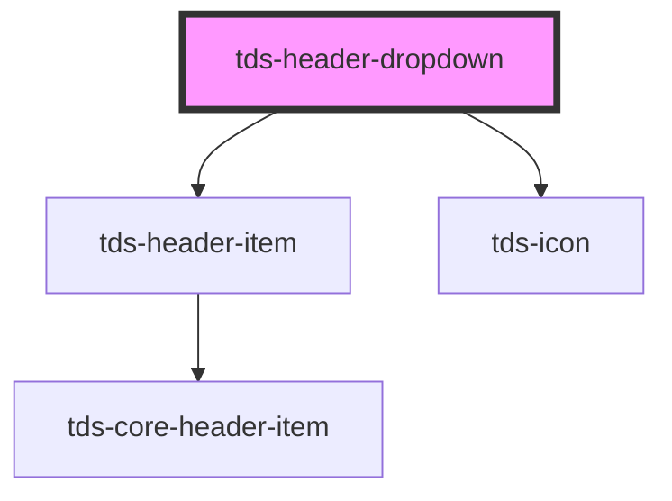

# tds-header-dropdown

<!-- Auto Generated Below -->

## Properties

| Property         | Attribute          | Description                                                                                       | Type      | Default     |
| ---------------- | ------------------ | ------------------------------------------------------------------------------------------------- | --------- | ----------- |
| `buttonLabel`    | `button-label`     | The label of the button that opens the dropdown. This is an alternative to the button-label slot. | `string`  | `undefined` |
| `noDropdownIcon` | `no-dropdown-icon` | If the dropdown icon (downwards chevron) should be hidden.                                        | `boolean` | `false`     |
| `selected`       | `selected`         | If the button that opens the dropdown should appear selected.                                     | `boolean` | `false`     |

## Dependencies

### Depends on

- [tds-header-item](../header-item)
- [tds-icon](../../icon)

### Graph

----------------------------------------------

*Built with [StencilJS](https://stenciljs.com/)*
