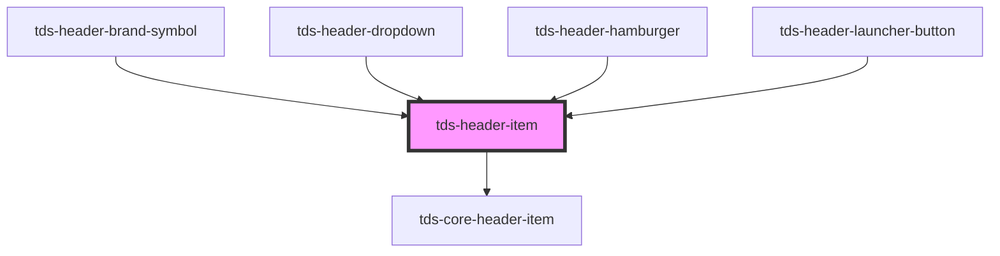

# tds-header-item

<!-- Auto Generated Below -->

## Properties

| Property   | Attribute  | Description                                                                                                                      | Type      | Default |
| ---------- | ---------- | -------------------------------------------------------------------------------------------------------------------------------- | --------- | ------- |
| `active`   | `active`   | If the button should appear active. Can be used when the button is triggering a dropdown, and the dropdown is open, for example. | `boolean` | `false` |
| `selected` | `selected` | If the button should appear selected.                                                                                            | `boolean` | `false` |

## Slots

| Slot          | Description                                        |
| ------------- | -------------------------------------------------- |
| `"<default>"` | <b>Unnamed slot.</b> For a link or button element. |

## Dependencies

### Used by

 - [tds-header-brand-symbol](../header-brand-symbol)
 - [tds-header-dropdown](../header-dropdown)
 - [tds-header-hamburger](../header-hamburger)
 - [tds-header-launcher-button](../header-launcher-button)

### Depends on

- [tds-core-header-item](../core-header-item)

### Graph

----------------------------------------------

*Built with [StencilJS](https://stenciljs.com/)*
