# tds-icon

<!-- Auto Generated Below -->

## Properties

| Property | Attribute | Description                                                                                                                                   | Type     | Default   |
| -------- | --------- | --------------------------------------------------------------------------------------------------------------------------------------------- | -------- | --------- |
| `name`   | `name`    | Pass a name of the icon. For icon names, refer to Storybook Icon controls dropdown or https://tegel.scania.com/foundations/icons/icon-library | `string` | `'truck'` |
| `size`   | `size`    | Pass a size of icon as a string, for example: 32px, 1rem, 4em...                                                                              | `string` | `'16px'`  |

## Dependencies

### Used by

 - [sdds-dropdown-option-v2](../dropdown-v2/dropdown-option-v2)
 - [sdds-dropdown-v2](../dropdown-v2)
 - [sdds-textarea](../textarea)
 - [tds-accordion-item](../accordion/accordion-item)
 - [tds-banner](../banner)
 - [tds-datetime](../datetime)
 - [tds-folder-tabs](../tabs/folder-tabs)
 - [tds-footer-group](../footer/footer-group)
 - [tds-header-dropdown](../header/header-dropdown)
 - [tds-header-hamburger](../header/header-hamburger)
 - [tds-header-launcher-button](../header/header-launcher-button)
 - [tds-inline-tabs](../tabs/inline-tabs)
 - [tds-message](../message)
 - [tds-modal](../modal)
 - [tds-navigation-tabs](../tabs/navigation-tabs)
 - [tds-side-menu-close-button](../side-menu/side-menu-close-button)
 - [tds-side-menu-dropdown](../side-menu/side-menu-dropdown)
 - [tds-slider](../slider)
 - [tds-stepper-item](../stepper/stepper-item)
 - [tds-table-footer](../table/table-footer)
 - [tds-text-field](../text-field)
 - [tds-toast](../toast)

### Graph

```mermaid
graph TD;
  sdds-dropdown-option-v2 --> tds-icon
  sdds-dropdown-v2 --> tds-icon
  sdds-textarea --> tds-icon
  tds-accordion-item --> tds-icon
  tds-banner --> tds-icon
  tds-datetime --> tds-icon
  tds-folder-tabs --> tds-icon
  tds-footer-group --> tds-icon
  tds-header-dropdown --> tds-icon
  tds-header-hamburger --> tds-icon
  tds-header-launcher-button --> tds-icon
  tds-inline-tabs --> tds-icon
  tds-message --> tds-icon
  tds-modal --> tds-icon
  tds-navigation-tabs --> tds-icon
  tds-side-menu-close-button --> tds-icon
  tds-side-menu-dropdown --> tds-icon
  tds-slider --> tds-icon
  tds-stepper-item --> tds-icon
  tds-table-footer --> tds-icon
  tds-text-field --> tds-icon
  tds-toast --> tds-icon
  style tds-icon fill:#f9f,stroke:#333,stroke-width:4px
```

----------------------------------------------

*Built with [StencilJS](https://stenciljs.com/)*
