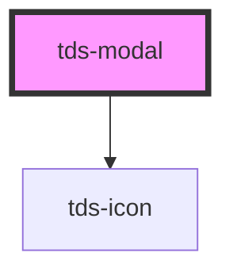

# tds-modal

<!-- Auto Generated Below -->

## Properties

| Property      | Attribute  | Description                                                                                                                                                 | Type                           | Default     |
| ------------- | ---------- | ----------------------------------------------------------------------------------------------------------------------------------------------------------- | ------------------------------ | ----------- |
| `actions`     | `actions`  | Sticky or Static Actions                                                                                                                                    | `"static" \| "sticky"`         | `'static'`  |
| `prevent`     | `prevent`  | Disables closing Modal on clicking on overlay area.                                                                                                         | `boolean`                      | `false`     |
| `referenceEl` | --         | Element that will show the Modal (takes priority over selector)                                                                                             | `HTMLElement`                  | `undefined` |
| `selector`    | `selector` | CSS selector for the element that will show the Modal.                                                                                                      | `string`                       | `undefined` |
| `show`        | `show`     | Controls whether the Modal is shown or not. If this is set hiding and showing will be decided by this prop and will need to be controlled from the outside. | `boolean`                      | `undefined` |
| `size`        | `size`     | Size of Modal                                                                                                                                               | `"lg" \| "md" \| "sm" \| "xs"` | `'md'`      |

## Events

| Event      | Description                      | Type               |
| ---------- | -------------------------------- | ------------------ |
| `tdsClose` | Emitts when the Modal is closed. | `CustomEvent<any>` |

## Methods

### `closeModal() => Promise<void>`

Closes the Modal.

#### Returns

Type: `Promise<void>`

### `showModal() => Promise<void>`

Shows the Modal.

#### Returns

Type: `Promise<void>`

## Dependencies

### Depends on

- [tds-icon](../icon)

### Graph

----------------------------------------------

*Built with [StencilJS](https://stenciljs.com/)*
