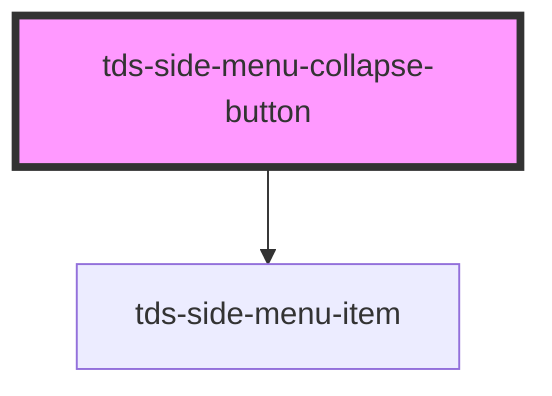

# tds-side-menu-collapse-button

<!-- Auto Generated Below -->

## Events

| Event         | Description                                                                                                                                                        | Type                                   |
| ------------- | ------------------------------------------------------------------------------------------------------------------------------------------------------------------ | -------------------------------------- |
| `tdsCollapse` | Event that is broadcast when the collapse button is clicked. Prevent it from disabling automatic collapsing, and set the collapsed prop on the Side Menu yourself. | `CustomEvent<{ collapsed: boolean; }>` |

## Dependencies

### Depends on

- [tds-side-menu-item](../side-menu-item)

### Graph

----------------------------------------------

*Built with [StencilJS](https://stenciljs.com/)*
