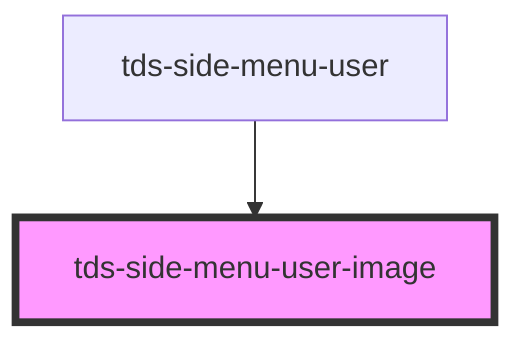

# tds-side-menu-user-image

<!-- Auto Generated Below -->

## Properties

| Property | Attribute | Description         | Type     | Default     |
| -------- | --------- | ------------------- | -------- | ----------- |
| `alt`    | `alt`     | The image alt text. | `string` | `undefined` |
| `src`    | `src`     | The image source.   | `string` | `undefined` |

## Slots

| Slot          | Description                                                                                                     |
| ------------- | --------------------------------------------------------------------------------------------------------------- |
| `"<default>"` | <b>Unnamed slot.</b> Used as alternative to props to inject <code> element directly into the DOM. |

## Dependencies

### Used by

 - [tds-side-menu-user](../side-menu-user)

### Graph

----------------------------------------------

*Built with [StencilJS](https://stenciljs.com/)*
