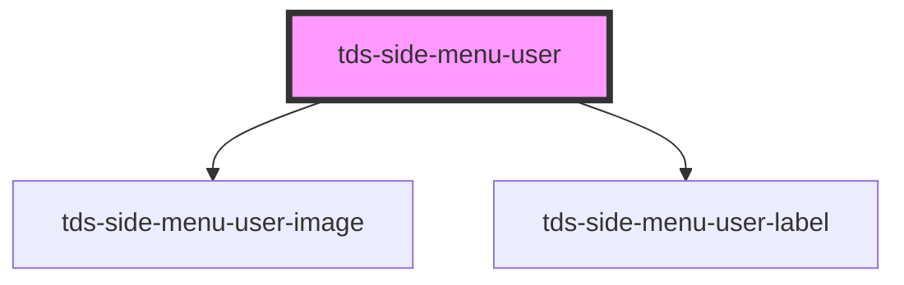

# tds-side-menu-user

<!-- Auto Generated Below -->

## Properties

| Property               | Attribute    | Description          | Type     | Default     |
| ---------------------- | ------------ | -------------------- | -------- | ----------- |
| `heading` _(required)_ | `heading`    | The heading text.    | `string` | `undefined` |
| `imgAlt`               | `img-alt`    | The image alt text.  | `string` | `undefined` |
| `imgSrc`               | `img-src`    | The image source.    | `string` | `undefined` |
| `subheading`           | `subheading` | The subheading text. | `string` | `undefined` |

## Slots

| Slot          | Description                                                                                                     |
| ------------- | --------------------------------------------------------------------------------------------------------------- |
| `"<default>"` | <b>Unnamed slot.</b> Used as alternative to props to inject <code> element directly into the DOM. |

## Dependencies

### Depends on

- [tds-side-menu-user-image](../side-menu-user-image)
- [tds-side-menu-user-label](../side-menu-user-label)

### Graph

----------------------------------------------

*Built with [StencilJS](https://stenciljs.com/)*
