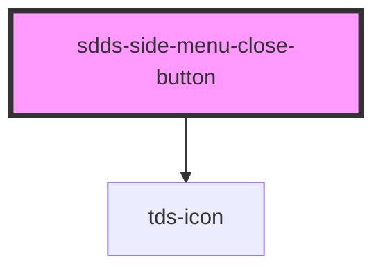

# sdds-side-menu-close-button

The Side Menu close button is a button that can be used to close the Side Menu.

Example:

```html
<sdds-side-menu-close-button></sdds-side-menu-close-button>
```

<!-- Auto Generated Below -->


## Dependencies

### Depends on

- [tds-icon](../../../icon)

### Graph


----------------------------------------------

*Built with [StencilJS](https://stenciljs.com/)*
