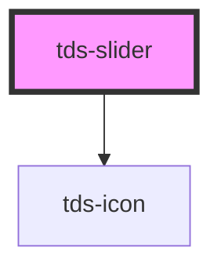

# tds-slider

<!-- Auto Generated Below -->

## Properties

| Property          | Attribute           | Description                                                                      | Type           | Default              |
| ----------------- | ------------------- | -------------------------------------------------------------------------------- | -------------- | -------------------- |
| `controls`        | `controls`          | Decide to show the controls or not                                               | `boolean`      | `false`              |
| `disabled`        | `disabled`          | Sets the disabled state for the whole component                                  | `boolean`      | `false`              |
| `input`           | `input`             | Decide to show the input field or not                                            | `boolean`      | `false`              |
| `label`           | `label`             | Text for label                                                                   | `string`       | `''`                 |
| `max`             | `max`               | Maximum value                                                                    | `string`       | `'100'`              |
| `min`             | `min`               | Minimum value                                                                    | `string`       | `'0'`                |
| `name`            | `name`              | Name property (will be inherited by the native slider component)                 | `string`       | `''`                 |
| `readOnly`        | `read-only`         | Sets the read only state for the whole component                                 | `boolean`      | `false`              |
| `scrubberSize`    | `scrubber-size`     | Sets the size of the scrubber                                                    | `"lg" \| "sm"` | `'lg'`               |
| `showTickNumbers` | `show-tick-numbers` | Decide to show numbers above the tick markers or not                             | `boolean`      | `false`              |
| `sliderId`        | `slider-id`         | ID for the Slider's input element, randomly generated if not specified.          | `string`       | `generateUniqueId()` |
| `snap`            | `snap`              | Snap to the tick's grid                                                          | `boolean`      | `false`              |
| `step`            | `step`              | Defines how much to increment/decrement the value when using controls            | `string`       | `'1'`                |
| `ticks`           | `ticks`             | Number of tick markers (tick for min- and max-value will be added automatically) | `string`       | `'0'`                |
| `tooltip`         | `tooltip`           | Decide to show the tooltip or not                                                | `boolean`      | `false`              |
| `value`           | `value`             | Initial value                                                                    | `string`       | `'0'`                |

## Events

| Event       | Description                                 | Type                              |
| ----------- | ------------------------------------------- | --------------------------------- |
| `tdsChange` | Sends the value of the slider when changed. | `CustomEvent<{ value: string; }>` |

## Methods

### `reset() => Promise<void>`

Public method to re-initialise the slider if some configuration props are changed

#### Returns

Type: `Promise<void>`

## Dependencies

### Depends on

- [tds-icon](../icon)

### Graph

----------------------------------------------

*Built with [StencilJS](https://stenciljs.com/)*
