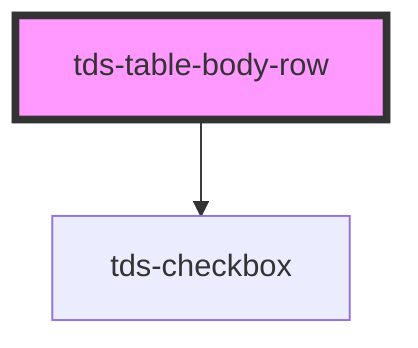

# tds-table-body-row

<!-- Auto Generated Below -->

## Properties

| Property   | Attribute  | Description                                            | Type      | Default |
| ---------- | ---------- | ------------------------------------------------------ | --------- | ------- |
| `selected` | `selected` | Marks the row as selected, used for multiselect table. | `boolean` | `false` |

## Events

| Event       | Description                                                                                                            | Type                                                  |
| ----------- | ---------------------------------------------------------------------------------------------------------------------- | ----------------------------------------------------- |
| `tdsSelect` | Send status of single row to the parent, tds-table component that hold logic for data export and main checkbox control | `CustomEvent<{ tableId: string; checked: boolean; }>` |

## Slots

| Slot          | Description                         |
| ------------- | ----------------------------------- |
| `"<default>"` | <b>Unnamed slot.</b> For the cells. |

## Dependencies

### Depends on

- [tds-checkbox](../../checkbox)

### Graph

----------------------------------------------

*Built with [StencilJS](https://stenciljs.com/)*
