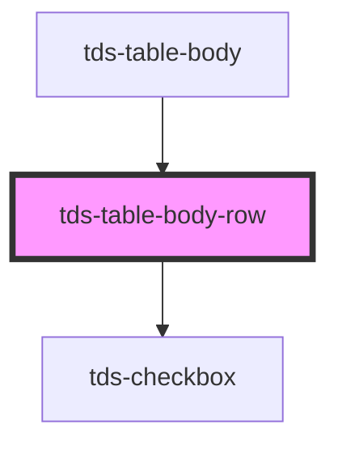

# tds-table-body-row

<!-- Auto Generated Below -->

## Slots

| Slot          | Description                         |
| ------------- | ----------------------------------- |
| `"<default>"` | <b>Unnamed slot.</b> For the cells. |

## Dependencies

### Used by

 - [tds-table-body](../table-body)

### Depends on

- [tds-checkbox](../../checkbox)

### Graph

----------------------------------------------

*Built with [StencilJS](https://stenciljs.com/)*
