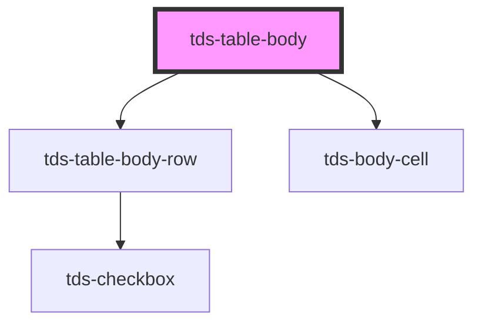

# tds-table-body

<!-- Auto Generated Below -->

## Properties

| Property          | Attribute           | Description                                                                        | Type     | Default     |
| ----------------- | ------------------- | ---------------------------------------------------------------------------------- | -------- | ----------- |
| `bodyData`        | `body-data`         | Prop to pass JSON string which enables automatic rendering of Table rows and cells | `any`    | `undefined` |
| `noResultMessage` | `no-result-message` | Prop for no result message when using filtering                                    | `string` | `undefined` |

## Slots

| Slot          | Description                                      |
| ------------- | ------------------------------------------------ |
| `"<default>"` | <b>Unnamed slot.</b> For table rows.             |
| `"no-result"` | Slot for no result message when using filtering. |

## Dependencies

### Depends on

- [tds-table-body-row](../table-body-row)
- [tds-body-cell](../table-body-cell)

### Graph

----------------------------------------------

*Built with [StencilJS](https://stenciljs.com/)*
