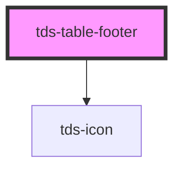

# tds-table-footer

<!-- Auto Generated Below -->

## Properties

| Property          | Attribute          | Description                                                                                                                               | Type      | Default     |
| ----------------- | ------------------ | ----------------------------------------------------------------------------------------------------------------------------------------- | --------- | ----------- |
| `cols`            | `cols`             | <b>Client override</b> Used to set the number of columns, use as fallback if the automatic count of columns fails.                        | `number`  | `null`      |
| `pages`           | `pages`            | Sets the number of pages.                                                                                                                 | `number`  | `null`      |
| `pagination`      | `pagination`       | Enable pagination and show pagination controls                                                                                            | `boolean` | `false`     |
| `paginationValue` | `pagination-value` | Sets the pagination number.                                                                                                               | `number`  | `1`         |
| `rowsPerPage`     | `rows-per-page`    | **[DEPRECATED]** Used to set rows per page, this also enabled automatic pagination of the table.   | `number`  | `undefined` |

## Events

| Event           | Description                                                                                                                          | Type                                                         |
| --------------- | ------------------------------------------------------------------------------------------------------------------------------------ | ------------------------------------------------------------ |
| `tdsPageChange` | Event to send current page value to tds-table-body component, can also be listened to in order to implement custom pagination logic. | `CustomEvent<{ tableId: string; paginationValue: number; }>` |

## Dependencies

### Depends on

- [tds-icon](../../icon)

### Graph

----------------------------------------------

*Built with [StencilJS](https://stenciljs.com/)*
