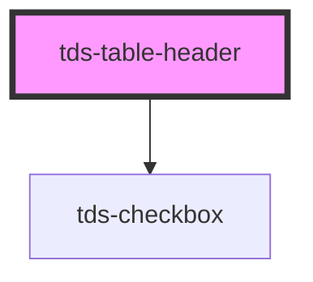

# tds-table-header-row

<!-- Auto Generated Below -->

## Events

| Event                | Description                                                       | Type                                             |
| -------------------- | ----------------------------------------------------------------- | ------------------------------------------------ |
| `tdsSelectAllChange` | Event emitted when the status of the select all checkbox changes. | `CustomEvent<{ id: string; checked: boolean; }>` |

## Dependencies

### Depends on

- [tds-checkbox](../../checkbox)

### Graph

----------------------------------------------

*Built with [StencilJS](https://stenciljs.com/)*
