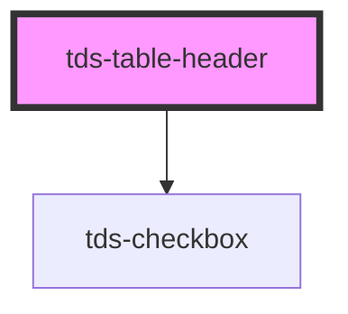

# tds-table-header-row

<!-- Auto Generated Below -->

## Slots

| Slot          | Description                                |
| ------------- | ------------------------------------------ |
| `"<default>"` | <b>Unnamed slot.</b> For the header cells. |

## Dependencies

### Depends on

- [tds-checkbox](../../checkbox)

### Graph

----------------------------------------------

*Built with [StencilJS](https://stenciljs.com/)*
