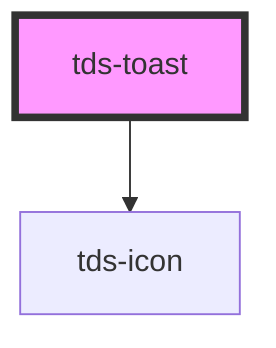

# tds-toast

<!-- Auto Generated Below -->

## Overview

/**

## Properties

| Property    | Attribute    | Description                                            | Type                                                 | Default               |
| ----------- | ------------ | ------------------------------------------------------ | ---------------------------------------------------- | --------------------- |
| `header`    | `header`     | Header text for the component.                         | `string`                                             | `undefined`           |
| `hidden`    | `hidden`     | Hides the Toast.                                       | `boolean`                                            | `false`               |
| `subheader` | `subheader`  | Subheader text for the component.                      | `string`                                             | `undefined`           |
| `toastId`   | `toast-id`   | ID for the Toast. Randomly generated if not specified. | `string`                                             | `crypto.randomUUID()` |
| `toastRole` | `toast-role` | ARIA role for the Toast.                               | `"alert" \| "log" \| "status"`                       | `'alert'`             |
| `type`      | `type`       | Type of Toast.                                         | `"error" \| "information" \| "success" \| "warning"` | `'information'`       |

## Events

| Event      | Description                                             | Type                                |
| ---------- | ------------------------------------------------------- | ----------------------------------- |
| `tdsClose` | Sends unique Toast identifier when component is closed. | `CustomEvent<{ toastId: string; }>` |

## Methods

### `hideToast() => Promise<void>`

Hides the Toast.

#### Returns

Type: `Promise<void>`

### `showToast() => Promise<void>`

Shows the Toast.

#### Returns

Type: `Promise<void>`

## Slots

| Slot                | Description                                        |
| ------------------- | -------------------------------------------------- |
| `"toast-bottom"`    | Slot for the Toast bottom section, used for links. |
| `"toast-header"`    | Slot for the Toast header.                         |
| `"toast-subheader"` | Slot for the Toast subheader.                      |

## Dependencies

### Depends on

- [tds-icon](../icon)

### Graph

----------------------------------------------

*Built with [StencilJS](https://stenciljs.com/)*
