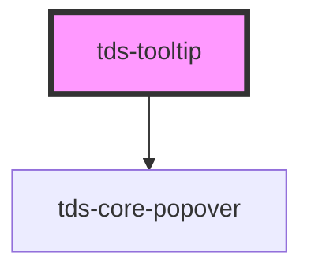

# tds-tooltip

<!-- Auto Generated Below -->

## Properties

| Property           | Attribute            | Description                                                                                    | Type                                                                                                                                                                                                         | Default     |
| ------------------ | -------------------- | ---------------------------------------------------------------------------------------------- | ------------------------------------------------------------------------------------------------------------------------------------------------------------------------------------------------------------ | ----------- |
| `mouseOverTooltip` | `mouse-over-tooltip` | Allow mouse over Tooltip. Useful when Tooltip contains clickable elements like link or button. | `boolean`                                                                                                                                                                                                    | `false`     |
| `placement`        | `placement`          | Placement of Tooltip.                                                                          | `"auto" \| "auto-end" \| "auto-start" \| "bottom" \| "bottom-end" \| "bottom-start" \| "left" \| "left-end" \| "left-start" \| "right" \| "right-end" \| "right-start" \| "top" \| "top-end" \| "top-start"` | `'bottom'`  |
| `referenceEl`      | --                   | Element that will trigger the Tooltip (takes priority over selector)                           | `HTMLElement`                                                                                                                                                                                                | `undefined` |
| `selector`         | `selector`           | The CSS-selector for an element that will trigger the Tooltip                                  | `string`                                                                                                                                                                                                     | `''`        |
| `show`             | `show`               | Prop in control of showing and hiding prop                                                     | `boolean`                                                                                                                                                                                                    | `false`     |
| `text`             | `text`               | In case Tooltip contains only text, no HTML, a text can be passed by this prop                 | `string`                                                                                                                                                                                                     | `''`        |

## Dependencies

### Depends on

- [tds-core-popover](../core-popover)

### Graph

## Slots

| Slot          | Description                                    |
| ------------- | ---------------------------------------------- |
| `"<default>"` | <b>Unnamed slot.</b> For the tooltip contents. |

----------------------------------------------

*Built with [StencilJS](https://stenciljs.com/)*
