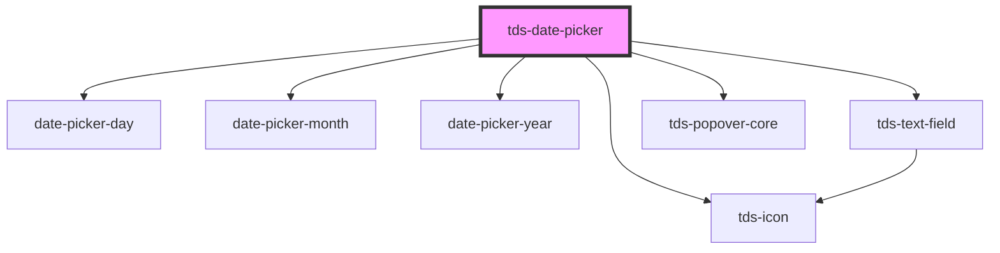

# tds-date-picker

<!-- Auto Generated Below -->

## Properties

| Property        | Attribute         | Description                                                                                                                                                                                       | Type                                  | Default              |
| --------------- | ----------------- | ------------------------------------------------------------------------------------------------------------------------------------------------------------------------------------------------- | ------------------------------------- | -------------------- |
| `datePickerId`  | `date-picker-id`  | ID used for internal Date Picker functionality and events, must be unique.                                                                                                                        | `string`                              | `generateUniqueId()` |
| `helper`        | `helper`          | Helper text for the Date Picker                                                                                                                                                                   | `string`                              | `undefined`          |
| `label`         | `label`           | Label text                                                                                                                                                                                        | `string`                              | `undefined`          |
| `labelPosition` | `label-position`  | Position of the label for the Text Field.                                                                                                                                                         | `"inside" \| "no-label" \| "outside"` | `'no-label'`         |
| `locale`        | `locale`          | Locale for displaying Months in a differnet language than enlish. Currently available: English, Swedish, German.                                                                                  | `"de" \| "en" \| "sv"`                | `'en'`               |
| `max`           | `max`             | Maximim selectable date.                                                                                                                                                                          | `string`                              | `undefined`          |
| `min`           | `min`             | Minimum selectable date.                                                                                                                                                                          | `string`                              | `undefined`          |
| `modeVariant`   | `mode-variant`    | Set the variant of the Datepicker.                                                                                                                                                                | `"primary" \| "secondary"`            | `undefined`          |
| `state`         | `state`           | State of the Date Picker                                                                                                                                                                          | `"default" \| "error" \| "success"`   | `'default'`          |
| `value`         | `value`           | The selected date of the Datepicker                                                                                                                                                               | `string`                              | `null`               |
| `variant`       | `variant`         | The variant of the Datepicker                                                                                                                                                                     | `"day" \| "month" \| "year"`          | `'day'`              |
| `weekDayLabels` | `week-day-labels` | Labels for the week days, should be a single string containing the first letter of each day of the week. For example: MTWTFSS -> Monday, Thursday, Wednesday, Thursday, Friday, Saturday, Sunday. | `string`                              | `'MTWTFSS'`          |
| `weekStartsOn`  | `week-starts-on`  | Sets which day the week starts on,  1 = Monday. If this is used, you will also need to set a custom weekDayLabels prop to correspond with this this update.                                       | `0 \| 1 \| 2 \| 3 \| 4 \| 5 \| 6`     | `1`                  |

## Events

| Event       | Description                               | Type                                          |
| ----------- | ----------------------------------------- | --------------------------------------------- |
| `tdsSelect` | Fires when a Date/Month/Year is selected. | `CustomEvent<{ value: string; id: string; }>` |

## Dependencies

### Depends on

- [date-picker-day](day)
- [date-picker-month](month)
- [date-picker-year](year)
- [tds-text-field](../../../text-field)
- [tds-icon](../../../icon)
- [tds-popover-core](../../../popover-core)

### Graph

----------------------------------------------

*Built with [StencilJS](https://stenciljs.com/)*
