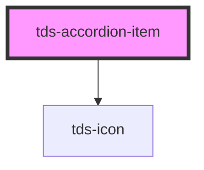

# tds-accordion-item

## Lazy rendered slot content

If you want to render content lazily when the accordion item is expanded, `tds-accordion-item` provides the following:

- `tdsToggle` — an event emitted when the item is clicked (before opening or closing)
- `isExpanded()` — a method that returns the current expanded state as a `Promise<boolean>`

These can be used to insert or remove slot content on demand. This avoids rendering hidden content until necessary and gives full control over what gets shown and when.

### Vanilla JS Example:

```html
    <tds-accordion>
      <tds-accordion-item
        header="Lazy Accordion"
        id="lazy-item"
      ></tds-accordion-item>
    </tds-accordion>

    <script type="module">
      import { defineCustomElements } from "@scania/tegel/loader";
      defineCustomElements();

      const item = document.getElementById("lazy-item");

      // Add event listener for accordion item toggle
      item.addEventListener("tdsToggle", async () => {
        // Use the isExpanded method to check if the item is expanded
        const isExpanded = await item.isExpanded?.();
        console.log("Accordion toggled. Expanded:", isExpanded);

        // If expanded, fetch and render content, else remove it
        if (isExpanded) {
          renderAccordionContent(item);
        } else {
          removeAccordionContent(item);
        }
      });

      function removeAccordionContent(item) {
        const content = item.querySelector("[slot]");
        if (content) {
          item.removeChild(content);
        }
      }

      async function renderAccordionContent(item) {
        if (item.querySelector("[slot]")) return;

        const content = document.createElement("div");
        content.slot = "";
        content.textContent = "Loading...";
        item.appendChild(content);

        try {
          const res = await fetch(
            "https://jsonplaceholder.typicode.com/posts/2"
          );
          const data = await res.json();

          // Add delay to simulate loading time
          setTimeout(() => {
            content.innerHTML = `
              <h4>${data.title}</h4>
              <p>${data.body}</p>
            `;
          }, 1000);
        } catch (err) {
          content.textContent = "Failed to load content.";
          console.error("Accordion fetch error:", err);
        }
      }
    </script>
```

<!-- Auto Generated Below -->


## Properties

| Property             | Attribute              | Description                                                                                      | Type                                     | Default |
| -------------------- | ---------------------- | ------------------------------------------------------------------------------------------------ | ---------------------------------------- | ------- |
| `ariaLevelValue`     | `aria-level-value`     | Specifies the heading level (aria-level) for accessibility. Only accepts values between 1 and 6. | `"1" \| "2" \| "3" \| "4" \| "5" \| "6"` | `'6'`   |
| `disabled`           | `disabled`             | Disabled option in `boolean`.                                                                    | `boolean`                                | `false` |
| `expandIconPosition` | `expand-icon-position` | Changes position of the expand icon.                                                             | `"end" \| "start"`                       | `'end'` |
| `expanded`           | `expanded`             | Set to true to expand panel open                                                                 | `boolean`                                | `false` |
| `header`             | `header`               | The header gives users the context about the additional information available inside the panel   | `string`                                 | `''`    |
| `paddingReset`       | `padding-reset`        | When true, 16px on right padding instead of 64px                                                 | `boolean`                                | `false` |


## Events

| Event       | Description                                                                  | Type                                  |
| ----------- | ---------------------------------------------------------------------------- | ------------------------------------- |
| `tdsToggle` | Fires when the Accordion Item is clicked, but before it is closed or opened. | `CustomEvent<{ expanded: boolean; }>` |


## Methods

### `collapse() => Promise<void>`

Method for collapsing the Accordion Item

#### Returns

Type: `Promise<void>`


### `expand() => Promise<void>`

Method for expanding the Accordion Item

#### Returns

Type: `Promise<void>`


### `isExpanded() => Promise<boolean>`

Returns the expanded state of the Accordion Item.

#### Returns

Type: `Promise<boolean>`


### `toggleAccordionItem() => Promise<void>`

Method for toggling the expanded state of the Accordion Item.

#### Returns

Type: `Promise<void>`


## Slots

| Slot          | Description                                                |
| ------------- | ---------------------------------------------------------- |
| `"<default>"` | <b>Unnamed slot.</b> For content of an expanded accordion. |
| `"header"`    | Slot for the Accordion Item header.                        |


## Dependencies

### Depends on

- [tds-icon](../../icon)

### Graph


----------------------------------------------

*Built with [StencilJS](https://stenciljs.com/)*
