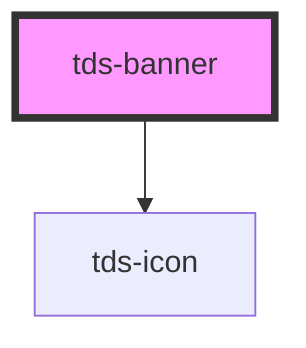

# tds-banner

<!-- Auto Generated Below -->

## Properties

| Property    | Attribute   | Description                                                                                                                                                                                                                                         | Type                                                                                                                                                                                                                                                                                                                                                                                                                                                                                                                                                                                                                                                                                                                                                                                                                                                                                                                                                                                                                                                                                                                                                                                                                                                                                                                                                                                                                                                                                                                                                                                                                                                                                                                                                                                                                                                                                                                                                                                                                                                                                                                                                                                                                                                                                                                                                                                                                                                                                | Default              |
| ----------- | ----------- | --------------------------------------------------------------------------------------------------------------------------------------------------------------------------------------------------------------------------------------------------- | ----------------------------------------------------------------------------------------------------------------------------------------------------------------------------------------------------------------------------------------------------------------------------------------------------------------------------------------------------------------------------------------------------------------------------------------------------------------------------------------------------------------------------------------------------------------------------------------------------------------------------------------------------------------------------------------------------------------------------------------------------------------------------------------------------------------------------------------------------------------------------------------------------------------------------------------------------------------------------------------------------------------------------------------------------------------------------------------------------------------------------------------------------------------------------------------------------------------------------------------------------------------------------------------------------------------------------------------------------------------------------------------------------------------------------------------------------------------------------------------------------------------------------------------------------------------------------------------------------------------------------------------------------------------------------------------------------------------------------------------------------------------------------------------------------------------------------------------------------------------------------------------------------------------------------------------------------------------------------------------------------------------------------------------------------------------------------------------------------------------------------------------------------------------------------------------------------------------------------------------------------------------------------------------------------------------------------------------------------------------------------------------------------------------------------------------------------------------------------------- | -------------------- |
| `bannerId`  | `banner-id` | ID used for internal table functionality and events, must be unique.  **NOTE**: If you're listening for Banner close events, you need to set this ID yourself to identify the Banner, as the default ID is random and will be different every time. | `string`                                                                                                                                                                                                                                                                                                                                                                                                                                                                                                                                                                                                                                                                                                                                                                                                                                                                                                                                                                                                                                                                                                                                                                                                                                                                                                                                                                                                                                                                                                                                                                                                                                                                                                                                                                                                                                                                                                                                                                                                                                                                                                                                                                                                                                                                                                                                                                                                                                                                            | `generateUniqueId()` |
| `header`    | `header`    | Header text.                                                                                                                                                                                                                                        | `string`                                                                                                                                                                                                                                                                                                                                                                                                                                                                                                                                                                                                                                                                                                                                                                                                                                                                                                                                                                                                                                                                                                                                                                                                                                                                                                                                                                                                                                                                                                                                                                                                                                                                                                                                                                                                                                                                                                                                                                                                                                                                                                                                                                                                                                                                                                                                                                                                                                                                            | `undefined`          |
| `hidden`    | `hidden`    | Hides the Banner                                                                                                                                                                                                                                    | `boolean`                                                                                                                                                                                                                                                                                                                                                                                                                                                                                                                                                                                                                                                                                                                                                                                                                                                                                                                                                                                                                                                                                                                                                                                                                                                                                                                                                                                                                                                                                                                                                                                                                                                                                                                                                                                                                                                                                                                                                                                                                                                                                                                                                                                                                                                                                                                                                                                                                                                                           | `false`              |
| `icon`      | `icon`      | Name of the icon for the component. For error and information variant, the icon is predefined.                                                                                                                                                      | `"24v_battery_inactive" \| "24v_battery" \| "arrow_diagonal" \| "arrow_down" \| "arrow_left" \| "arrow_right" \| "arrow_up" \| "audio_inactive" \| "back" \| "backward_inactive" \| "backward" \| "bento" \| "burger" \| "calendar_inactive" \| "calendar" \| "card" \| "cart" \| "charging_speed_inactive" \| "charging_speed" \| "charging_stopped" \| "chevron_down" \| "chevron_left" \| "chevron_right" \| "chevron_up" \| "clock_inactive" \| "clock" \| "contact_inactive" \| "contact" \| "copy" \| "cross" \| "dashboard" \| "document_check" \| "document_doc" \| "document_eye" \| "document_pdf" \| "document_ppt" \| "document_tool" \| "document_wrong" \| "document_xls" \| "document" \| "dollar" \| "doner" \| "double_kebab" \| "download" \| "edit_inactive" \| "edit" \| "email" \| "error" \| "expand" \| "export_inactive" \| "export" \| "eye_inactive" \| "eye" \| "face_dissatisfied" \| "face_neutral" \| "face_satisfied" \| "filters_inactive" \| "filters" \| "flash" \| "folder" \| "forward_inactive" \| "fuel_gauge_inactive" \| "fuel_gauge" \| "global" \| "hatch_open_inactive" \| "heart_inactive" \| "heart" \| "heating_inactive_screen" \| "history_inactive" \| "history" \| "home_inactive" \| "home" \| "image_add" \| "image_inactive" \| "image_set" \| "image" \| "info" \| "insights" \| "kebab" \| "link_broken" \| "link" \| "lock_inactive" \| "lock" \| "maximize_fullscreen" \| "meatballs" \| "message_inactive" \| "message" \| "mileage_inactive" \| "mileage" \| "minimize_fullscreen" \| "minus" \| "notification_inactive" \| "notification" \| "pause_inactive" \| "pause" \| "phone_inactive" \| "phone" \| "pie_chart" \| "pin_inactive" \| "pin" \| "plus" \| "print_inactive" \| "print" \| "profile_inactive" \| "profile" \| "proportions_inactive" \| "proportions" \| "range_inactive" \| "range" \| "redirect" \| "refresh_inactive" \| "refresh" \| "reload_inactive" \| "reload" \| "report_inactive" \| "report" \| "save_inactive" \| "save" \| "search" \| "send_inactive" \| "send" \| "settings" \| "share" \| "skip_backwards" \| "skip_forward" \| "smartphone_inactive" \| "smartphone" \| "sorting" \| "speedometer_inactive" \| "speedometer" \| "star" \| "support" \| "target_inactive" \| "target" \| "text_inactive" \| "tick" \| "timer" \| "tool_inactive" \| "tool" \| "trailer" \| "trash_inactive" \| "trash" \| "truck" \| "upload" \| "wallet" \| "warning" \| "wifi_inactive" \| "wifi"` | `undefined`          |
<<<<<<< HEAD
=======
| `roleType`  | `role-type` | Defines the ARIA role of the banner. Defaults to "banner" for global use, but can be set to "region" or "alert" if used differently.                                                                                                                | `"alert" \| "banner" \| "region"`                                                                                                                                                                                                                                                                                                                                                                                                                                                                                                                                                                                                                                                                                                                                                                                                                                                                                                                                                                                                                                                                                                                                                                                                                                                                                                                                                                                                                                                                                                                                                                                                                                                                                                                                                                                                                                                                                                                                                                                                                                                                                                                                                                                                                                                                                                                                                                                                                                                   | `'banner'`           |
>>>>>>> bc15e79f (feat(banner): improve accessibility)
| `subheader` | `subheader` | Subheader text.                                                                                                                                                                                                                                     | `string`                                                                                                                                                                                                                                                                                                                                                                                                                                                                                                                                                                                                                                                                                                                                                                                                                                                                                                                                                                                                                                                                                                                                                                                                                                                                                                                                                                                                                                                                                                                                                                                                                                                                                                                                                                                                                                                                                                                                                                                                                                                                                                                                                                                                                                                                                                                                                                                                                                                                            | `undefined`          |
| `variant`   | `variant`   | Variant of Banner                                                                                                                                                                                                                                   | `"default" \| "error" \| "information"`                                                                                                                                                                                                                                                                                                                                                                                                                                                                                                                                                                                                                                                                                                                                                                                                                                                                                                                                                                                                                                                                                                                                                                                                                                                                                                                                                                                                                                                                                                                                                                                                                                                                                                                                                                                                                                                                                                                                                                                                                                                                                                                                                                                                                                                                                                                                                                                                                                             | `'default'`          |

## Events

| Event      | Description                                                        | Type                                 |
| ---------- | ------------------------------------------------------------------ | ------------------------------------ |
| `tdsClose` | Sends a unique Banner identifier when the close button is pressed. | `CustomEvent<{ bannerId: string; }>` |

## Methods

### `hideBanner() => Promise<void>`

Hides the Banner.

#### Returns

Type: `Promise<void>`

### `showBanner() => Promise<void>`

Shows the Banner

#### Returns

Type: `Promise<void>`

## Slots

| Slot          | Description                                             |
| ------------- | ------------------------------------------------------- |
| `"actions"`   | Slot for the bottom part of the Banner, used for links. |
| `"header"`    | Slot for the Header of the Banner                       |
| `"subheader"` | Slot for the Subheader of the Banner                    |

## Dependencies

### Depends on

- [tds-icon](../icon)

### Graph

----------------------------------------------

*Built with [StencilJS](https://stenciljs.com/)*
