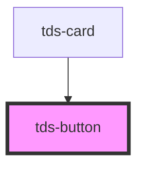

# tds-button

<!-- Auto Generated Below -->

## Properties

| Property       | Attribute        | Description                                                                  | Type                                              | Default     |
| -------------- | ---------------- | ---------------------------------------------------------------------------- | ------------------------------------------------- | ----------- |
| `animation`    | `animation`      | Determines if and how the button should animate.                             | `"fade" \| "none"`                                | `'none'`    |
| `disabled`     | `disabled`       | Control for disabled state of a component                                    | `boolean`                                         | `false`     |
| `fullbleed`    | `fullbleed`      | When enabled, the Button takes 100% width                                    | `boolean`                                         | `false`     |
| `modeVariant`  | `mode-variant`   | Set the mode variant of the Button.                                          | `"primary" \| "secondary" \| null`                | `null`      |
| `name`         | `name`           | The name attribute allows for different ways of accessing the button element | `string \| undefined`                             | `undefined` |
| `size`         | `size`           | Size of a Button                                                             | `"lg" \| "md" \| "sm" \| "xs"`                    | `'lg'`      |
| `tdsAriaLabel` | `tds-aria-label` | The value to be used for the aria-label attribute if onlyIcon is set to true | `string \| undefined`                             | `undefined` |
| `text`         | `text`           | Text displayed inside the Button                                             | `string \| undefined`                             | `undefined` |
| `type`         | `type`           | Button's type                                                                | `"button" \| "reset" \| "submit"`                 | `'button'`  |
| `value`        | `value`          | The value attribute can be used when handling a form submission              | `string \| undefined`                             | `undefined` |
| `variant`      | `variant`        | Variation of Button's design                                                 | `"danger" \| "ghost" \| "primary" \| "secondary"` | `'primary'` |

## Slots

| Slot      | Description                                                      |
| --------- | ---------------------------------------------------------------- |
| `"icon"`  | Slot used to display an Icon in the Button.                      |
| `"label"` | Slot for the text injection. Serves as alternative to text prop. |

## Dependencies

### Used by

 - [tds-card](../card)

### Graph

----------------------------------------------

*Built with [StencilJS](https://stenciljs.com/)*
