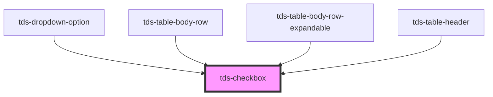

# tds-checkbox

<!-- Auto Generated Below -->

## Properties

| Property             | Attribute              | Description                                                               | Type                  | Default              |
| -------------------- | ---------------------- | ------------------------------------------------------------------------- | --------------------- | -------------------- |
| `checkboxId`         | `checkbox-id`          | ID for the Checkbox's input element. Randomly generated if not specified. | `string`              | `generateUniqueId()` |
| `checked`            | `checked`              | Sets the Checkbox as checked                                              | `boolean`             | `false`              |
| `disabled`           | `disabled`             | Sets the Checkbox in a disabled state                                     | `boolean`             | `false`              |
| `indeterminate`      | `indeterminate`        | Sets the Checkbox as indeterminate                                        | `boolean`             | `false`              |
| `name`               | `name`                 | Name for the Checkbox's input element.                                    | `string \| undefined` | `undefined`          |
| `required`           | `required`             | Make the Checkbox required                                                | `boolean`             | `false`              |
| `tdsAriaDescribedby` | `tds-aria-describedby` | Value to be used for the aria-describedby attribute                       | `string \| undefined` | `undefined`          |
| `tdsAriaLabel`       | `tds-aria-label`       | Value to be used for the aria-label attribute                             | `string \| undefined` | `undefined`          |
| `value`              | `value`                | Value for the Checkbox                                                    | `string \| undefined` | `undefined`          |

## Events

| Event       | Description                                                                       | Type                                                                                                          |
| ----------- | --------------------------------------------------------------------------------- | ------------------------------------------------------------------------------------------------------------- |
| `tdsBlur`   | Blur event for the Checkbox                                                       | `CustomEvent<FocusEvent>`                                                                                     |
| `tdsChange` | Sends unique Checkbox identifier and checked status when it is checked/unchecked. | `CustomEvent<{ checkboxId: string; checked: boolean; indeterminate: boolean; value?: string \| undefined; }>` |
| `tdsFocus`  | Focus event for the Checkbox                                                      | `CustomEvent<FocusEvent>`                                                                                     |

## Methods

### `focusElement() => Promise<void>`

Method to programmatically focus the checkbox element

#### Returns

Type: `Promise<void>`

### `toggleCheckbox() => Promise<{ checkboxId: string; checked: boolean; }>`

Toggles the checked value of the component.

#### Returns

Type: `Promise<{ checkboxId: string; checked: boolean; }>`

## Slots

| Slot      | Description              |
| --------- | ------------------------ |
| `"label"` | Slot for the label text. |

## Dependencies

### Used by

 - [tds-dropdown-option](../dropdown/dropdown-option)
 - [tds-table-body-row](../table/table-body-row)
 - [tds-table-body-row-expandable](../table/table-body-row-expandable)
 - [tds-table-header](../table/table-header)

### Graph

----------------------------------------------

*Built with [StencilJS](https://stenciljs.com/)*
