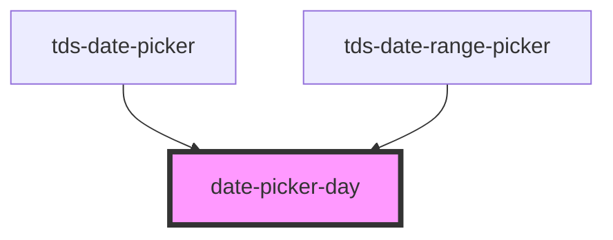

# datepicker-date

<!-- Auto Generated Below -->

## Properties

| Property         | Attribute          | Description | Type      | Default     |
| ---------------- | ------------------ | ----------- | --------- | ----------- |
| `date`           | --                 |             | `Date`    | `undefined` |
| `disabled`       | `disabled`         |             | `boolean` | `false`     |
| `fallsInRange`   | `falls-in-range`   |             | `boolean` | `false`     |
| `firstDate`      | `first-date`       |             | `boolean` | `false`     |
| `fullDate`       | --                 |             | `Date`    | `undefined` |
| `isCurrentMonth` | `is-current-month` |             | `boolean` | `true`      |
| `lastDate`       | `last-date`        |             | `boolean` | `false`     |
| `selected`       | `selected`         |             | `boolean` | `false`     |

## Dependencies

### Used by

 - [tds-date-picker](..)
 - [tds-date-range-picker](../../date-range-picker)

### Graph

----------------------------------------------

*Built with [StencilJS](https://stenciljs.com/)*
