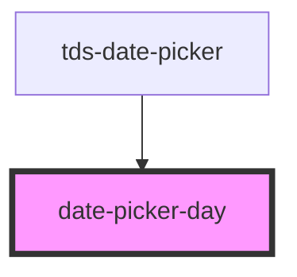

# datepicker-date

<!-- Auto Generated Below -->

## Properties

| Property          | Attribute           | Description                                                  | Type      | Default     |
| ----------------- | ------------------- | ------------------------------------------------------------ | --------- | ----------- |
| `date`            | --                  | The Date.                                                    | `Date`    | `undefined` |
| `disabled`        | `disabled`          | Marks the Date as disabled.                                  | `boolean` | `false`     |
| `notCurrentMonth` | `not-current-month` | Marks the date as not part of the currently displayed month. | `boolean` | `undefined` |
| `selected`        | `selected`          | Marks the Date as selected.                                  | `boolean` | `false`     |

## Dependencies

### Used by

 - [tds-date-picker](..)

### Graph

----------------------------------------------

*Built with [StencilJS](https://stenciljs.com/)*
