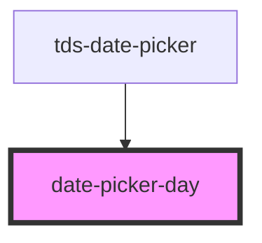

# datepicker-date

<!-- Auto Generated Below -->

## Properties

| Property         | Attribute          | Description | Type      | Default     |
| ---------------- | ------------------ | ----------- | --------- | ----------- |
| `date`           | `date`             |             | `string`  | `undefined` |
| `isCurrentMonth` | `is-current-month` |             | `boolean` | `true`      |
| `selected`       | `selected`         |             | `boolean` | `false`     |

## Dependencies

### Used by

 - [tds-date-picker](..)

### Graph

----------------------------------------------

*Built with [StencilJS](https://stenciljs.com/)*
