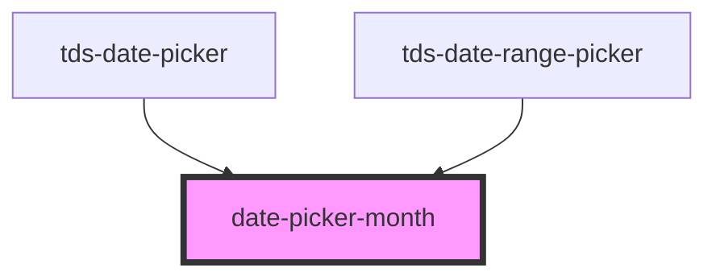

# datepicker-month

<!-- Auto Generated Below -->

## Properties

| Property   | Attribute  | Description | Type      | Default |
| ---------- | ---------- | ----------- | --------- | ------- |
| `disabled` | `disabled` |             | `boolean` | `false` |
| `month`    | `month`    |             | `string`  | `''`    |
| `selected` | `selected` |             | `boolean` | `false` |

## Dependencies

### Used by

 - [tds-date-picker](..)
 - [tds-date-range-picker](../../date-range-picker)

### Graph

----------------------------------------------

*Built with [StencilJS](https://stenciljs.com/)*
