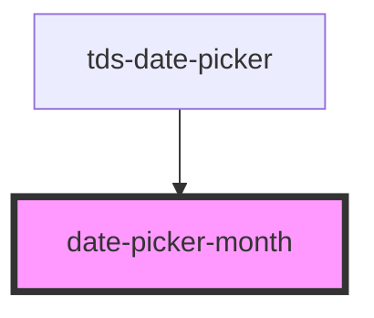

# datepicker-month

<!-- Auto Generated Below -->

## Properties

| Property   | Attribute  | Description                                                                                                      | Type                   | Default     |
| ---------- | ---------- | ---------------------------------------------------------------------------------------------------------------- | ---------------------- | ----------- |
| `disabled` | `disabled` | Marks the Month as disabled.                                                                                     | `boolean`              | `false`     |
| `locale`   | `locale`   | Locale for displaying months in a differnet language than enlish. Currently available: English, Swedish, German. | `"de" \| "en" \| "sv"` | `'en'`      |
| `month`    | --         | The Month that should be displayed.                                                                              | `Date`                 | `undefined` |
| `selected` | `selected` | Marks the Month as selected.                                                                                     | `boolean`              | `false`     |

## Dependencies

### Used by

 - [tds-date-picker](..)

### Graph

----------------------------------------------

*Built with [StencilJS](https://stenciljs.com/)*
