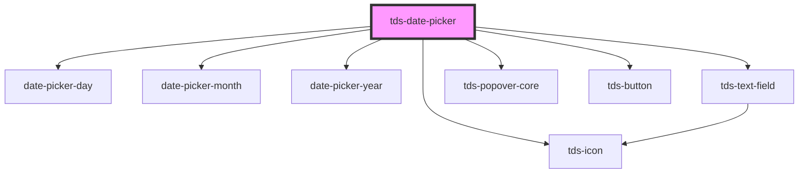

# tds-date-picker

<!-- Auto Generated Below -->

## Properties

| Property        | Attribute         | Description                                                                                                                                                                                       | Type                                  | Default                                    |
| --------------- | ----------------- | ------------------------------------------------------------------------------------------------------------------------------------------------------------------------------------------------- | ------------------------------------- | ------------------------------------------ |
| `datePickerId`  | `date-picker-id`  | ID used for internal Date Picker functionality and events, must be unique.                                                                                                                        | `string`                              | `generateUniqueId()`                       |
| `helper`        | `helper`          | Helper text for the Date Picker                                                                                                                                                                   | `string`                              | `undefined`                                |
| `label`         | `label`           | Label text                                                                                                                                                                                        | `string`                              | `undefined`                                |
| `labelPosition` | `label-position`  | Position of the label for the Text Field.                                                                                                                                                         | `"inside" \| "no-label" \| "outside"` | `'no-label'`                               |
| `modeVariant`   | `mode-variant`    | Set the variant of the Datepicker.                                                                                                                                                                | `"primary" \| "secondary"`            | `undefined`                                |
| `selectedDate`  | `selected-date`   | The selected date of the Datepicker                                                                                                                                                               | `string`                              | `format(startOfToday(), this.getFormat())` |
| `state`         | `state`           | State of the Date Picker                                                                                                                                                                          | `"default" \| "error" \| "success"`   | `'default'`                                |
| `variant`       | `variant`         | The variant of the Datepicker                                                                                                                                                                     | `"day" \| "month" \| "year"`          | `'day'`                                    |
| `weekDayLabels` | `week-day-labels` | Labels for the week days, should be a single string containing the first letter of each day of the week. For example: MTWTFSS -> Monday, Thursday, Wednesday, Thursday, Friday, Saturday, Sunday. | `string`                              | `'MTWTFSS'`                                |

## Events

| Event       | Description                                                                  | Type                                         |
| ----------- | ---------------------------------------------------------------------------- | -------------------------------------------- |
| `tdsSelect` | Fires when the Accordion Item is clicked, but before it is closed or opened. | `CustomEvent<{ date: string; id: string; }>` |

## Dependencies

### Depends on

- [date-picker-day](day)
- [date-picker-month](month)
- [date-picker-year](year)
- [tds-text-field](../text-field)
- [tds-icon](../icon)
- [tds-popover-core](../popover-core)
- [tds-button](../button)

### Graph

----------------------------------------------

*Built with [StencilJS](https://stenciljs.com/)*
