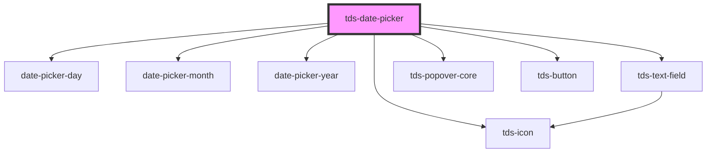

# tds-date-picker

<!-- Auto Generated Below -->

## Properties

| Property       | Attribute       | Description                         | Type                         | Default                                    |
| -------------- | --------------- | ----------------------------------- | ---------------------------- | ------------------------------------------ |
| `modeVariant`  | `mode-variant`  | Set the variant of the Datepicker.  | `"primary" \| "secondary"`   | `undefined`                                |
| `selectedDate` | `selected-date` | The selected date of the Datepicker | `string`                     | `format(startOfToday(), this.getFormat())` |
| `variant`      | `variant`       | The variant of the Datepicker       | `"day" \| "month" \| "year"` | `'year'`                                   |

## Dependencies

### Depends on

- [date-picker-day](day)
- [date-picker-month](month)
- [date-picker-year](year)
- [tds-text-field](../text-field)
- [tds-icon](../icon)
- [tds-popover-core](../popover-core)
- [tds-button](../button)

### Graph

----------------------------------------------

*Built with [StencilJS](https://stenciljs.com/)*
