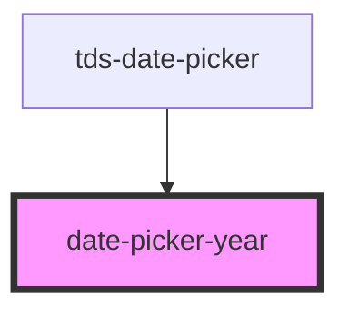

# datepicker-year

<!-- Auto Generated Below -->

## Properties

| Property   | Attribute  | Description                        | Type      | Default     |
| ---------- | ---------- | ---------------------------------- | --------- | ----------- |
| `disabled` | `disabled` | Marks the Year as selected.        | `boolean` | `false`     |
| `selected` | `selected` | Marks the Year as selected.        | `boolean` | `false`     |
| `year`     | --         | The Year that should be displayed. | `Date`    | `undefined` |

## Dependencies

### Used by

 - [tds-date-picker](..)

### Graph

----------------------------------------------

*Built with [StencilJS](https://stenciljs.com/)*
