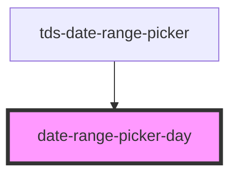

# datepicker-date

<!-- Auto Generated Below -->

## Properties

| Property         | Attribute          | Description | Type      | Default     |
| ---------------- | ------------------ | ----------- | --------- | ----------- |
| `date`           | --                 |             | `Date`    | `undefined` |
| `disabled`       | `disabled`         |             | `boolean` | `false`     |
| `firstInRange`   | `first-in-range`   |             | `boolean` | `false`     |
| `inRange`        | `in-range`         |             | `boolean` | `false`     |
| `isCurrentMonth` | `is-current-month` |             | `boolean` | `true`      |
| `lastInRange`    | `last-in-range`    |             | `boolean` | `false`     |
| `selected`       | `selected`         |             | `boolean` | `false`     |

## Dependencies

### Used by

 - [tds-date-range-picker](..)

### Graph

----------------------------------------------

*Built with [StencilJS](https://stenciljs.com/)*
