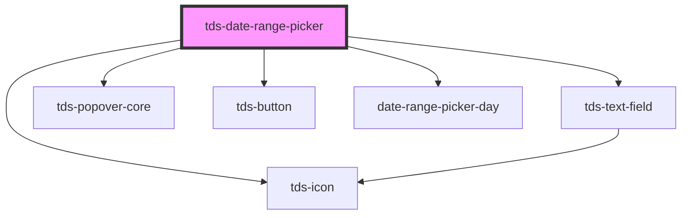

# tds-date-range-picker

<!-- Auto Generated Below -->

## Properties

| Property          | Attribute           | Description                                                                                                                                                                                       | Type                                  | Default                               |
| ----------------- | ------------------- | ------------------------------------------------------------------------------------------------------------------------------------------------------------------------------------------------- | ------------------------------------- | ------------------------------------- |
| `datePickerId`    | `date-picker-id`    | ID used for internal Date Range Picker functionality and events, must be unique.                                                                                                                  | `string`                              | `generateUniqueId()`                  |
| `endDateHelper`   | `end-date-helper`   | Helper text for the End Date                                                                                                                                                                      | `string`                              | `undefined`                           |
| `endDateLabel`    | `end-date-label`    | Label text for the End Date                                                                                                                                                                       | `string`                              | `undefined`                           |
| `endValue`        | `end-value`         | The selected end date for the Date Range Picker                                                                                                                                                   | `string`                              | `undefined`                           |
| `labelPosition`   | `label-position`    | Position of the label for the Text Fields. TODO: Should it be granular enough to chose differnet for each Text Field                                                                              | `"inside" \| "no-label" \| "outside"` | `'no-label'`                          |
| `max`             | `max`               | Maximim selectable date.                                                                                                                                                                          | `string`                              | `undefined`                           |
| `min`             | `min`               | Minimum selectable date.                                                                                                                                                                          | `string`                              | `undefined`                           |
| `modeVariant`     | `mode-variant`      | Set the variant of the Datepicker.                                                                                                                                                                | `"primary" \| "secondary"`            | `undefined`                           |
| `startDateHelper` | `start-date-helper` | Helper text for the Start Date                                                                                                                                                                    | `string`                              | `undefined`                           |
| `startDateLabel`  | `start-date-label`  | Label text for the Start Date                                                                                                                                                                     | `string`                              | `format(startOfToday(), this.format)` |
| `startValue`      | `start-value`       | The selected start date for the Date Range Picker                                                                                                                                                 | `string`                              | `null`                                |
| `state`           | `state`             | State of the Date Range Picker                                                                                                                                                                    | `"default" \| "error" \| "success"`   | `'default'`                           |
| `weekDayLabels`   | `week-day-labels`   | Labels for the week days, should be a single string containing the first letter of each day of the week. For example: MTWTFSS -> Monday, Thursday, Wednesday, Thursday, Friday, Saturday, Sunday. | `string`                              | `'MTWTFSS'`                           |

## Events

| Event       | Description                                            | Type                                         |
| ----------- | ------------------------------------------------------ | -------------------------------------------- |
| `tdsSelect` | Fires when a Date is selected in the Date Range Picker | `CustomEvent<{ date: string; id: string; }>` |

## Dependencies

### Depends on

- [tds-text-field](../text-field)
- [tds-icon](../icon)
- [tds-popover-core](../popover-core)
- [tds-button](../button)
- [date-range-picker-day](range-day)

### Graph

----------------------------------------------

*Built with [StencilJS](https://stenciljs.com/)*
