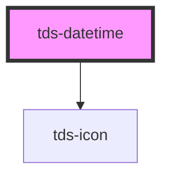

# tds-datetime

The tds-datetime component currently has the following limitations:

- Users can set an invalid date (e.g., 2025-02-31) using the arrow keys.
- The arrow keys allow navigation beyond the allowed date range, including dates earlier than the min property. This can cause unintended behavior, such as the year overflowing and becoming the maximum possible value.

These issues stem from the use of the native HTML <code style="font-size: inherit !important">&lt;input&gt;</code> element with type="date", which inherits these limitations.

We are addressing these concerns in the upcoming tds-date-picker component, which will replace tds-datetime with improved validation and user experience.

 

<!-- Auto Generated Below -->

## Properties

| Property       | Attribute       | Description                                                                                                                                                               | Type                                                        | Default            |
| -------------- | --------------- | ------------------------------------------------------------------------------------------------------------------------------------------------------------------------- | ----------------------------------------------------------- | ------------------ |
| `autofocus`    | `autofocus`     | Autofocus for input                                                                                                                                                       | `boolean`                                                   | `false`            |
| `defaultValue` | `default-value` | Default value of the component. Format for time: HH-MM. Format for date: YY-MM-DD. Format for month: YY-MM. Format for week: YY-Www  Format for date-time: YY-MM-DDTHH-MM | `string`                                                    | `'none'`           |
| `disabled`     | `disabled`      | Set input in disabled state                                                                                                                                               | `boolean`                                                   | `false`            |
| `helper`       | `helper`        | Helper text for the component                                                                                                                                             | `string`                                                    | `''`               |
| `label`        | `label`         | Label text for the component                                                                                                                                              | `string`                                                    | `''`               |
| `max`          | `max`           | Sets max value. Example for different types: datetime="2023-01-31T00:00" date="2023-01-01" time="15:00"                                                                   | `string`                                                    | `undefined`        |
| `min`          | `min`           | Sets min value. Example for different types: datetime="2023-01-31T00:00" date="2023-01-01" time="15:00"                                                                   | `string`                                                    | `undefined`        |
| `modeVariant`  | `mode-variant`  | Set the variant of the Datetime component.                                                                                                                                | `"primary" \| "secondary"`                                  | `null`             |
| `name`         | `name`          | Name property                                                                                                                                                             | `string`                                                    | `''`               |
| `noMinWidth`   | `no-min-width`  | Resets min width rule                                                                                                                                                     | `boolean`                                                   | `false`            |
| `size`         | `size`          | Size of the input                                                                                                                                                         | `"lg" \| "md" \| "sm"`                                      | `'lg'`             |
| `state`        | `state`         | Error state of input                                                                                                                                                      | `string`                                                    | `undefined`        |
| `type`         | `type`          | Sets an input type                                                                                                                                                        | `"date" \| "datetime-local" \| "month" \| "time" \| "week"` | `'datetime-local'` |
| `value`        | `value`         | Value of the input text                                                                                                                                                   | `string`                                                    | `''`               |

## Events

| Event       | Description                   | Type                      |
| ----------- | ----------------------------- | ------------------------- |
| `tdsBlur`   | Blur event for the Datetime   | `CustomEvent<FocusEvent>` |
| `tdsChange` | Change event for the Datetime | `CustomEvent<any>`        |
| `tdsFocus`  | Focus event for the Datetime  | `CustomEvent<FocusEvent>` |
| `tdsInput`  | Input event for the Datetime  | `CustomEvent<InputEvent>` |

## Methods

### `reset() => Promise<void>`

Method that resets the value of the Datetime, using defaultValue if is not 'none'

#### Returns

Type: `Promise<void>`

### `setValue(newValue: string) => Promise<void>`

Method that sets the value of the datetime element

#### Parameters

| Name       | Type     | Description |
| ---------- | -------- | ----------- |
| `newValue` | `string` |             |

#### Returns

Type: `Promise<void>`

## Dependencies

### Depends on

- [tds-icon](../icon)

### Graph

----------------------------------------------

*Built with [StencilJS](https://stenciljs.com/)*
