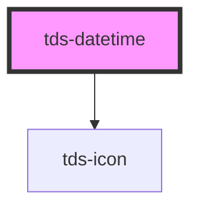

# tds-datetime

🚧 This component is not yet accessible. Please refer to the [Accessibility Guidelines](https://tds-storybook.tegel.scania.com/?path=/docs/foundations-accessibility--docs) for more information.

The tds-datetime component currently has the following limitations:

- Users can set an invalid date (e.g., 2025-02-31) using the arrow keys.
- The arrow keys allow navigation beyond the allowed date range, including dates earlier than the min property. This can cause unintended behavior, such as the year overflowing and becoming the maximum possible value.

These issues stem from the use of the native HTML <code style="font-size: inherit !important">&lt;input&gt;</code> element with type="date", which inherits these limitations.

We are addressing these concerns in the upcoming tds-date-picker component, which will replace tds-datetime with improved validation and user experience.

 

<!-- Auto Generated Below -->

## Properties

| Property        | Attribute        | Description                                                                                                                                                                                            | Type                                                        | Default                            |
| --------------- | ---------------- | ------------------------------------------------------------------------------------------------------------------------------------------------------------------------------------------------------ | ----------------------------------------------------------- | ---------------------------------- |
| `autofocus`     | `autofocus`      | Autofocus for input                                                                                                                                                                                    | `boolean`                                                   | `false`                            |
| `defaultValue`  | `default-value`  | Default value of the component. Format for date-time: yyyy-MM-ddTHH:mm. Format for date: yyyy-MM-dd. Format for month: yyyy-MM. Format for week: yyyy-Www. Format for time: HH:mm. | `string`                                                    | `'none'`                           |
| `disabled`      | `disabled`       | Set input in disabled state                                                                                                                                                                            | `boolean`                                                   | `false`                            |
| `helper`        | `helper`         | Default contextual helper text for the component for states = success or none                                                                                                                          | `string`                                                    | `''`                               |
| `helperError`   | `helper-error`   | Contextual helper text for the component for error state                                                                                                                                               | `string \| undefined`                                       | `undefined`                        |
| `label`         | `label`          | Label text for the component                                                                                                                                                                           | `string`                                                    | `''`                               |
| `labelPosition` | `label-position` | Position of the label                                                                                                                                                                                  | `"inside" \| "no-label" \| "outside"`                       | `'no-label'`                       |
| `max`           | `max`            | Sets max value. Example for different types: datetime="2023-01-31T00:00" date="2023-01-01" month="2023-01" week="2023-W02" time="15:00"                                        | `string \| undefined`                                       | `undefined`                        |
| `min`           | `min`            | Sets min value. Example for different types: datetime="2023-01-31T00:00" date="2023-01-01" month="2023-01" week="2023-W02" time="15:00"                                        | `string \| undefined`                                       | `undefined`                        |
| `modeVariant`   | `mode-variant`   | Set the variant of the Datetime component.                                                                                                                                                             | `"primary" \| "secondary" \| null`                          | `null`                             |
| `name`          | `name`           | Name property. Uses a unique ID as fallback if not specified.                                                                                                                                          | `string`                                                    | ``datetime-${generateUniqueId()}`` |
| `noMinWidth`    | `no-min-width`   | Resets min width rule                                                                                                                                                                                  | `boolean`                                                   | `false`                            |
| `size`          | `size`           | Size of the input                                                                                                                                                                                      | `"lg" \| "md" \| "sm"`                                      | `'lg'`                             |
| `state`         | `state`          | Switches between success and error state.                                                                                                                                                              | `"error" \| "none" \| "success" \| undefined`               | `undefined`                        |
| `tdsAriaLabel`  | `tds-aria-label` | Value for the aria-label attribute                                                                                                                                                                     | `string \| undefined`                                       | `undefined`                        |
| `type`          | `type`           | Sets an input type                                                                                                                                                                                     | `"date" \| "datetime-local" \| "month" \| "time" \| "week"` | `'datetime-local'`                 |
| `value`         | `value`          | Value of the input text                                                                                                                                                                                | `string`                                                    | `''`                               |

## Events

| Event       | Description                   | Type                      |
| ----------- | ----------------------------- | ------------------------- |
| `tdsBlur`   | Blur event for the Datetime   | `CustomEvent<FocusEvent>` |
| `tdsChange` | Change event for the Datetime | `CustomEvent<any>`        |
| `tdsFocus`  | Focus event for the Datetime  | `CustomEvent<FocusEvent>` |
| `tdsInput`  | Input event for the Datetime  | `CustomEvent<InputEvent>` |

## Methods

### `focusElement() => Promise<void>`

Method to programmatically focus the datetime element

#### Returns

Type: `Promise<void>`

### `reset() => Promise<void>`

Method that resets the value of the Datetime, using defaultValue if is not 'none'

#### Returns

Type: `Promise<void>`

### `setValue(newValue: string) => Promise<void>`

Method that sets the value of the datetime element

#### Parameters

| Name       | Type     | Description |
| ---------- | -------- | ----------- |
| `newValue` | `string` |             |

#### Returns

Type: `Promise<void>`

## Dependencies

### Depends on

- [tds-icon](../icon)

### Graph

----------------------------------------------

*Built with [StencilJS](https://stenciljs.com/)*
