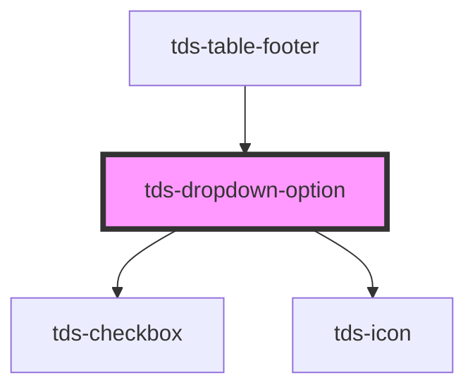

# tds-dropdown-option

<!-- Auto Generated Below -->

## Properties

| Property       | Attribute        | Description                                                                                                                                      | Type                            | Default     |
| -------------- | ---------------- | ------------------------------------------------------------------------------------------------------------------------------------------------ | ------------------------------- | ----------- |
| `disabled`     | `disabled`       | Sets the option as disabled.                                                                                                                     | `boolean`                       | `false`     |
| `group`        | `group`          | Associates the option with a dropdown group. Use together with `group-parent` on the parent option or on child options that belong to the group. | `string \| undefined`           | `undefined` |
| `groupParent`  | `group-parent`   | Marks the option as the parent checkbox for all options in the same group.                                                                       | `boolean`                       | `false`     |
| `tdsAriaLabel` | `tds-aria-label` | Defines aria-label attribute for the option                                                                                                      | `string \| undefined`           | `undefined` |
| `value`        | `value`          | Value of the dropdown option                                                                                                                     | `number \| string \| undefined` | `undefined` |

## Events

| Event       | Description                          | Type                                                                                                                  |
| ----------- | ------------------------------------ | --------------------------------------------------------------------------------------------------------------------- |
| `tdsBlur`   | Blur event for the Dropdown option.  | `CustomEvent<FocusEvent>`                                                                                             |
| `tdsFocus`  | Focus event for the Dropdown option. | `CustomEvent<FocusEvent>`                                                                                             |
| `tdsSelect` | Click event for the Dropdown option. | `CustomEvent<{ selected: boolean; value: string; group?: string \| undefined; groupParent?: boolean \| undefined; }>` |

## Methods

### `setGroupState(state: { checked: boolean; indeterminate: boolean; disabled?: boolean; }) => Promise<void>`

Updates the parent group checkbox state.

#### Parameters

| Name    | Type                                                                             | Description |
| ------- | -------------------------------------------------------------------------------- | ----------- |
| `state` | `{ checked: boolean; indeterminate: boolean; disabled?: boolean \| undefined; }` |             |

#### Returns

Type: `Promise<void>`

### `setSelected(selected: boolean) => Promise<void>`

Method to select/deselect an option.

#### Parameters

| Name       | Type      | Description |
| ---------- | --------- | ----------- |
| `selected` | `boolean` |             |

#### Returns

Type: `Promise<void>`

## Slots

| Slot          | Description                                     |
| ------------- | ----------------------------------------------- |
| `"<default>"` | <b>Unnamed slot.</b> For the option label text. |

## Dependencies

### Used by

 - [tds-table-footer](../../table/table-footer)

### Depends on

- [tds-checkbox](../../checkbox)
- [tds-icon](../../icon)

### Graph

----------------------------------------------

*Built with [StencilJS](https://stenciljs.com/)*
