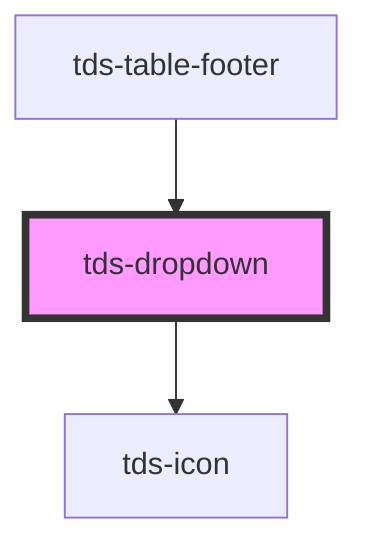

# tds-dropdown

🚧 This component is not yet accessible. Please refer to the [Accessibility Guidelines](https://tds-storybook.tegel.scania.com/?path=/docs/foundations-accessibility--docs) for more information.

### Good to know
 - Setting type='time' together with min and max props will not prevent user from set time outside min-max range. It is known issue for native input element. Here is more about it and how to work with it: [Time validation](https://developer.mozilla.org/en-US/docs/Web/HTML/Element/input/time#validation)

**Important**: When you programmatically change the text content of dropdown options, you must call the `updateDisplay()` method to update the display. The dropdown does not automatically detect text content changes.

Example usage:
```javascript
// After changing option text content
const optionElement = document.querySelector('tds-dropdown-option[value="option-1"]');
optionElement.textContent = 'New Option Text';

// Call updateDisplay to refresh the dropdown display
const dropdown = document.querySelector('tds-dropdown');
dropdown.updateDisplay();
```

<!-- Auto Generated Below -->


## Properties

| Property        | Attribute        | Description                                                                                                                                                | Type                                       | Default       |
| --------------- | ---------------- | ---------------------------------------------------------------------------------------------------------------------------------------------------------- | ------------------------------------------ | ------------- |
| `animation`     | `animation`      |                                                                                                                                                            | `"none" \| "slide"`                        | `'slide'`     |
| `defaultValue`  | `default-value`  | Default value selected in the Dropdown.                                                                                                                    | `number \| string`                         | `undefined`   |
| `disabled`      | `disabled`       | Sets the Dropdown in a disabled state                                                                                                                      | `boolean`                                  | `false`       |
| `error`         | `error`          | Sets the Dropdown in an error state                                                                                                                        | `boolean`                                  | `false`       |
| `filter`        | `filter`         | Enables filtration in the Dropdown.                                                                                                                        | `boolean`                                  | `false`       |
| `helper`        | `helper`         | Helper text for the Dropdown.                                                                                                                              | `string`                                   | `undefined`   |
| `label`         | `label`          | Label text for the Dropdown.                                                                                                                               | `string`                                   | `undefined`   |
| `labelPosition` | `label-position` | Label text position                                                                                                                                        | `"inside" \| "outside"`                    | `undefined`   |
| `modeVariant`   | `mode-variant`   | Mode variant of the component, based on current mode.                                                                                                      | `"primary" \| "secondary"`                 | `null`        |
| `multiselect`   | `multiselect`    | Enables multiselect in the Dropdown.                                                                                                                       | `boolean`                                  | `false`       |
| `name`          | `name`           | Name for the Dropdowns input element.                                                                                                                      | `string`                                   | `undefined`   |
| `noResultText`  | `no-result-text` | Text that is displayed if filter is used and there are no options that matches the search. Setting it to an empty string disables message from showing up. | `string`                                   | `'No result'` |
| `normalizeText` | `normalize-text` | Normalizes input text for fuzzier search                                                                                                                   | `boolean`                                  | `true`        |
| `openDirection` | `open-direction` | The direction the Dropdown should open, auto if not specified.                                                                                             | `"auto" \| "down" \| "up"`                 | `'auto'`      |
| `placeholder`   | `placeholder`    | Placeholder text for the Dropdown.                                                                                                                         | `string`                                   | `undefined`   |
| `size`          | `size`           | The size of the Dropdown.                                                                                                                                  | `"lg" \| "md" \| "sm" \| "xs"`             | `'lg'`        |
| `tdsAriaLabel`  | `tds-aria-label` | Defines aria-label attribute for input                                                                                                                     | `string`                                   | `undefined`   |
| `value`         | `value`          | Value of the dropdown. For multiselect, provide array of strings/numbers. For single select, provide a string/number.                                      | `(string \| number)[] \| number \| string` | `null`        |


## Events

| Event       | Description                    | Type                                            |
| ----------- | ------------------------------ | ----------------------------------------------- |
| `tdsBlur`   | Blur event for the Dropdown.   | `CustomEvent<FocusEvent>`                       |
| `tdsChange` | Change event for the Dropdown. | `CustomEvent<{ name: string; value: string; }>` |
| `tdsFocus`  | Focus event for the Dropdown.  | `CustomEvent<FocusEvent>`                       |
| `tdsInput`  | Input event for the Dropdown.  | `CustomEvent<InputEvent>`                       |


## Methods

### `close() => Promise<void>`

Method for closing the Dropdown.

#### Returns

Type: `Promise<void>`


### `focusElement() => Promise<void>`

Method that forces focus on the input element.

#### Returns

Type: `Promise<void>`


### `removeValue(oldValue: string) => Promise<void>`


#### Parameters

| Name       | Type     | Description |
| ---------- | -------- | ----------- |
| `oldValue` | `string` |             |

#### Returns

Type: `Promise<void>`


### `reset() => Promise<void>`


#### Returns

Type: `Promise<void>`


### `setValue(value: string | number | string[] | number[], label?: string) => Promise<{ value: string | number; label: string; }[]>`

Method for setting the selected value of the Dropdown.

Single selection example:

<code>
dropdown.setValue('option-1', 'Option 1');
</code>

Multiselect example:

<code>
dropdown.setValue(['option-1', 'option-2']);
</code>

#### Parameters

| Name    | Type                                       | Description |
| ------- | ------------------------------------------ | ----------- |
| `value` | `string \| number \| string[] \| number[]` |             |
| `label` | `string`                                   |             |

#### Returns

Type: `Promise<{ value: string | number; label: string; }[]>`


### `updateDisplay() => Promise<void>`

Method to force update the dropdown display value.
Use this method when you programmatically change the text content of dropdown options
to ensure the selected value display updates immediately.

#### Returns

Type: `Promise<void>`


## Slots

| Slot          | Description                                        |
| ------------- | -------------------------------------------------- |
| `"<default>"` | <b>Unnamed slot.</b> For dropdown option elements. |


## Dependencies

### Used by

 - [tds-table-footer](../table/table-footer)

### Depends on

- [tds-icon](../icon)

### Graph


----------------------------------------------

*Built with [StencilJS](https://stenciljs.com/)*
