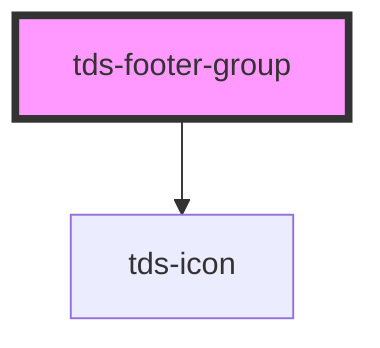

# tds-footer-group

<!-- Auto Generated Below -->

## Properties

| Property    | Attribute    | Description                                                      | Type     | Default     |
| ----------- | ------------ | ---------------------------------------------------------------- | -------- | ----------- |
| `titleText` | `title-text` | Title text for the link group, only valid on top part of Footer. | `string` | `undefined` |

## Slots

| Slot          | Description                            |
| ------------- | -------------------------------------- |
| `"<default>"` | <b>Unnamed slot.</b> For footer items. |

## Dependencies

### Depends on

- [tds-icon](../../icon)

### Graph

----------------------------------------------

*Built with [StencilJS](https://stenciljs.com/)*
