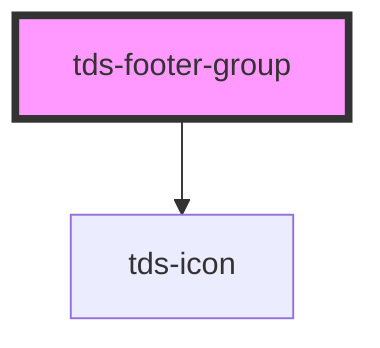

# tds-footer-group

<!-- Auto Generated Below -->

## Properties

| Property           | Attribute             | Description                                                                                                              | Type     | Default     |
| ------------------ | --------------------- | ------------------------------------------------------------------------------------------------------------------------ | -------- | ----------- |
| `tdsListAriaLabel` | `tds-list-aria-label` | Value to be used for the aria-label attribute for the nav element wrapping the list. Should be unique for accessibility. | `string` | `undefined` |
| `titleText`        | `title-text`          | Title text for the link group, only valid on top part of Footer.                                                         | `string` | `undefined` |

## Slots

| Slot          | Description                                                                                                                                           |
| ------------- | ----------------------------------------------------------------------------------------------------------------------------------------------------- |
| `"<default>"` | <b>Unnamed slot.</b> For footer items.                                                                                                                |
| `"title"`     | Slot for the title of the group. Should contain a heading element adjusted to the rest of the website in terms of heading nesting, for accessibility. |

## Dependencies

### Depends on

- [tds-icon](../../icon)

### Graph

----------------------------------------------

*Built with [StencilJS](https://stenciljs.com/)*
